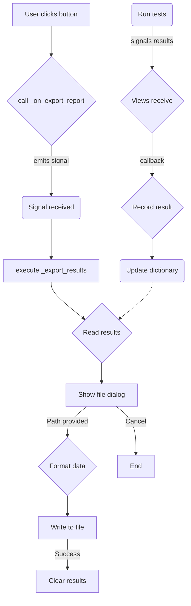

# Export Result 流程分析

本文件詳細說明了從使用者介面觸發 `Export Report` 到最終生成報告檔案的完整工作流程。

## 核心關係

整個流程由幾個關鍵模組協同工作完成：

1.  **`AutoDiagnosticView` (`auto_diagnostic_view.py`)**: 提供使用者操作的入口，即 "Export Report" 按鈕。
2.  **`MainWindowController` (`main_window.py`)**: 作為應用程式的主控制器，它監聽來自 `AutoDiagnosticView` 的訊號，並執行核心的匯出邏輯 (`_export_results`)。它也負責暫存來自各個測試模組的結果。
3.  **`TestManagerView` (`test_manager.py`)**: 功能測試的管理視圖，是匯出資料的另一個主要來源。
4.  **`HardwareTestManagerService` (`hardware_test_manager.py`)**: 後端服務，實際執行硬體測試任務，並透過訊號將原始結果回傳給 UI 層。

## 流程圖 (極簡診斷版)

## 步驟詳解

1.  **觸發**: 使用者在 `AutoDiagnosticView` 介面點擊 "Export Report" 按鈕。
2.  **訊號傳遞**: 按鈕的點擊事件會呼叫 `_on_export_report` 方法，該方法會發出一個名為 `export_report_requested` 的 Qt 訊號。
3.  **中央處理**: `MainWindowController` 一直在監聽此訊號。一旦接收到訊號，它便會執行 `_export_results` 方法。
4.  **資料收集**: 在測試過程中，`HardwareTestManagerService` 會執行各項測試，並將結果透過訊號傳遞給 `AutoDiagnosticView` 和 `TestManagerView`。這些 View 再透過設定好的回呼函式 (`record_test_result`) 將格式化後的結果傳遞給 `MainWindowController`，並儲存在 `unified_test_results` 字典中。
5.  **檔案儲存**: `_export_results` 方法首先會彈出一個檔案對話框，讓使用者選擇儲存位置和檔名。
6.  **寫入與清理**: 使用者確認後，方法會讀取 `unified_test_results` 中的所有資料，將其格式化並寫入一個 CSV 檔案。匯出成功後，會呼叫 `clear_all_test_results` 方法來清空已儲存的結果並重設相關 UI，為下一次測試做準備。
