# Orion (VT Hydra) 開發文件

## 1. 系統概述

Orion（VT Hydra）是一個基於Python和PySide6（Qt）開發的硬體測試工具，用於管理和測試各種硬體裝置。系統主要透過串列通訊介面與硬體裝置進行互動，執行預定義的測試步驟，並提供使用者友善的圖形介面來展示測試結果。

系統的主要功能包含：
- 裝置連接和管理
- 硬體測試執行
- 測試資料收集與分析
- 多種硬體模組測試支援（USB連接埠、EMMC、EEPROM等）
- 可擴充的測試框架

## 2. 系統架構

Orion採用分層架構設計，遵循MVVM（Model-View-ViewModel）設計模式，清楚地分離了使用者介面、業務邏輯和資料模型，提高了程式碼的可維護性和可擴充性。

### 2.1 分層詳解

系統分為以下幾個主要層次：

1. **表現層（GUI）**：
   - 使用者介面元件，包含登入介面、裝置管理介面等
   - 基於PySide6實現，提供現代化的使用者體驗
   - 透過ViewModel與業務邏輯層互動

2. **業務邏輯層（Core）**：
   - 核心測試邏輯和測試步驟的定義與執行
   - 裝置管理和通訊服務
   - 測試工作執行緒和非同步操作處理

3. **資料層（Models）**：
   - 資料結構和模型定義
   - 狀態管理和資料儲存

4. **工具層（Util）**：
   - 日誌記錄
   - 通用功能和輔助工具

### 2.2 核心元件關係

核心元件之間的關係：

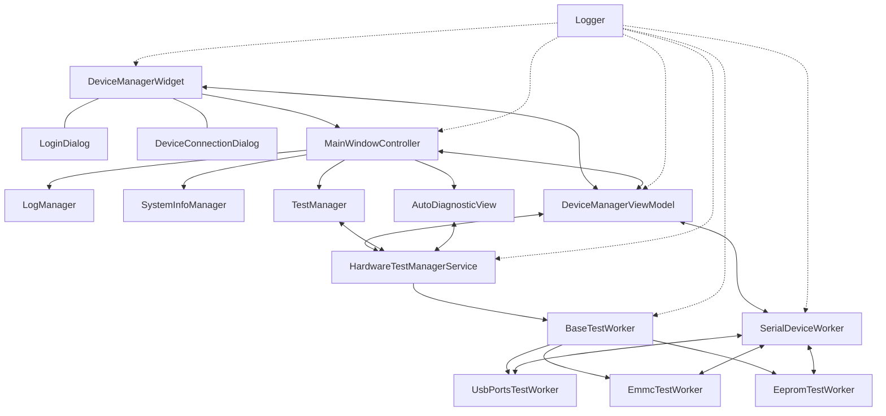

- **DeviceManagerWidget**：裝置管理介面，負責裝置連線並開啟裝置專屬的主視窗
  
- **MainWindowController**：主窗口控制器，直接與使用者互動，管理單個裝置的顯示和操作界面
  - **LogManager**：日誌管理器，負責處理應用程式日誌的顯示與儲存
  - **SystemInfoManager**：系統信息管理器，負責收集和顯示裝置系統信息
  - **TestManager**：測試管理器，協調UI與測試服務間的互動
  - **AutoDiagnosticView**：自動診斷視圖，管理診斷測試的執行與結果顯示

- **DeviceManagerViewModel**：視圖模型，連接UI和業務邏輯
  
- **SerialDeviceWorker**：裝置通訊工作執行緒，負責與硬體裝置的串列通訊

- **HardwareTestManagerService**：測試管理服務，協調各種測試工作執行緒的執行

- **BaseTestWorker**：基礎測試工作執行緒，提供測試步驟定義和執行框架

- **各種具體測試工作執行緒**：如UsbPortsTestWorker、EmmcTestWorker等，實現具體測試邏輯

## 3. 核心模組說明

### 3.1 GUI 模組 (gui/)

GUI模組採用MVVM架構，包含以下子模組：

```mermaid
graph TD
    A[views]
    B[view_models]
    C[widgets]
    D[ui]
    
    A --> A1[device_connection_dialog.py]
    A --> A2[device_manager_widget.py]
    A --> A3[main_window.py]
    A --> A4[log_manager.py]
    A --> A5[system_info_manager.py]
    A --> A6[test_manager.py]
    A --> A7[auto_diagnostic_view.py]
    
    B --> B1[device_manager_view_model.py]
    
    C --> C1[自定義UI元件]
    C --> C2[test_group_widget.py]
    C --> C3[test_container.py]
    C --> C4[diagnostic_container.py]
    C --> C5[diagnostic_item_widget.py]
    
    D --> D1[介面資源檔案]
```

- **views/**: 包含各種視圖介面
  - `device_connection_dialog.py`: 裝置連線主介面
  - `device_manager_widget.py`: 裝置管理主介面
  - `main_window.py`: 裝置監控主窗口控制器，處理單一裝置的監控介面
  - `log_manager.py`: 日誌管理器，處理應用程式日誌顯示與管理
  - `system_info_manager.py`: 系統信息管理器，處理裝置系統信息的收集與顯示
  - `test_manager.py`: 測試管理器，處理硬體測試功能的UI介面與邏輯
  - `auto_diagnostic_view.py`: 自動診斷視圖控制器，管理診斷測試的執行與UI更新

- **view_models/**: 視圖模型，負責業務邏輯與UI的連接
  - `device_manager_view_model.py`: 裝置管理視圖模型，處理裝置連接和命令發送等操作

- **widgets/**: 可重複使用UI元件
  - `test_group_widget.py`: 測試組元件，用於顯示和管理一組相關的測試項目
  - `test_container.py`: 測試容器元件，用於包含和管理多個測試組
  - `diagnostic_container.py`: 診斷容器元件，用於管理和顯示多個診斷項目
  - `diagnostic_item_widget.py`: 診斷項目元件，顯示單個診斷測試項目及其狀態
  - 包含其他各種自定義控制項和UI元件

- **ui/**: 介面資源檔案
  - 包含UI設計檔案和資源

### 3.2 核心邏輯 (core/)

核心模組包含系統的主要業務邏輯：

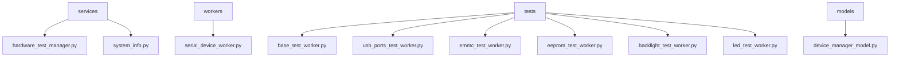

- **services/**: 核心服務
  - `hardware_test_manager.py`: 硬體測試管理程式，協調測試執行
  - `system_info.py`: 系統資訊服務，收集和管理系統資訊

- **workers/**: 工作執行緒
  - `serial_device_worker.py`: 串列裝置工作執行緒，負責與裝置通訊

- **tests/**: 測試模組
  - `base_test_worker.py`: 基礎測試工作執行緒，提供測試步驟定義和執行框架
  - `usb_ports_test_worker.py`: USB連接埠測試
  - `emmc_test_worker.py`: EMMC測試
  - `eeprom_test_worker.py`: EEPROM測試
  - `backlight_test_worker.py`: 背光測試
  - `led_test_worker.py`: LED測試

- **models/**: 資料模型
  - `device_manager_model.py`: 裝置管理模型，處理裝置數據和狀態

### 3.3 公共元件 (util/)

工具模組提供全域可用的實用工具：

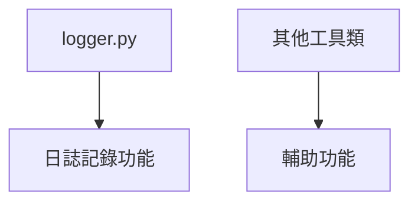

- `logger.py`: 日誌記錄器，提供統一的日誌記錄介面
- 其他通用功能和輔助工具

## 4. 執行流程

Orion系統的典型執行流程如下：

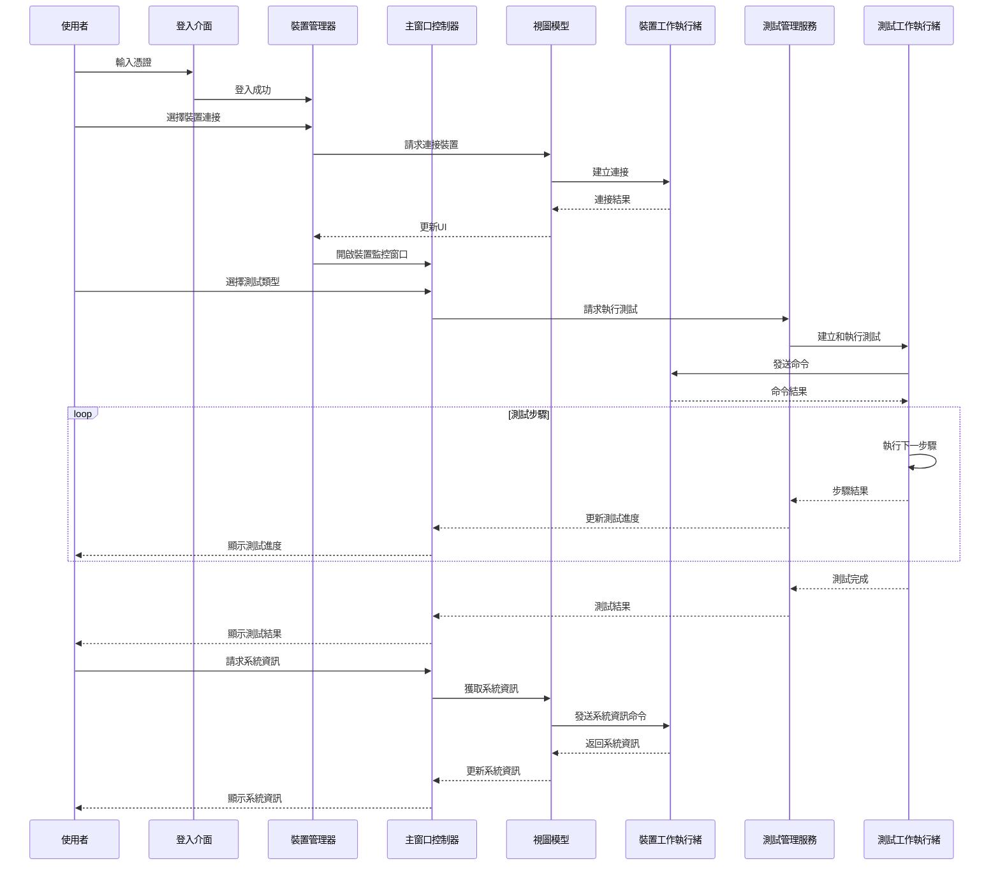

1. **系統啟動**：
   - 在`main.py`中建立PySide6應用程式實例
   - 設定應用程式樣式和圖示
   - 顯示登入介面

2. **使用者登入**：
   - 使用者在登入介面輸入憑證
   - 驗證成功後進入裝置管理介面

3. **裝置連接**：
   - 使用者在裝置管理介面選擇並連接裝置
   - `DeviceManagerViewModel`處理連接請求
   - `SerialDeviceWorker`執行實際的裝置連接操作
   - 連接成功後，開啟`MainWindowController`管理的裝置監控視窗

4. **裝置監控與控制**：
   - `MainWindowController`負責顯示裝置狀態和系統資訊
   - 使用者可以發送命令、查看日誌和執行硬體測試
   - 系統資訊可以通過刷新按鈕更新

5. **測試執行**：
   - 使用者在裝置監控視窗中選擇測試類型
   - `MainWindowController`通過`HardwareTestManagerService`請求執行測試
   - 測試管理服務建立相應的測試工作執行緒
   - 測試步驟執行過程中實時反饋到UI介面

6. **結果處理**：
   - 測試完成後，結果顯示在裝置監控介面
   - 使用者可以查看詳細的測試日誌和步驟結果
   - 可以選擇進行其他測試或返回裝置管理介面

## 5. 系統狀態機

系統主要包含以下狀態：

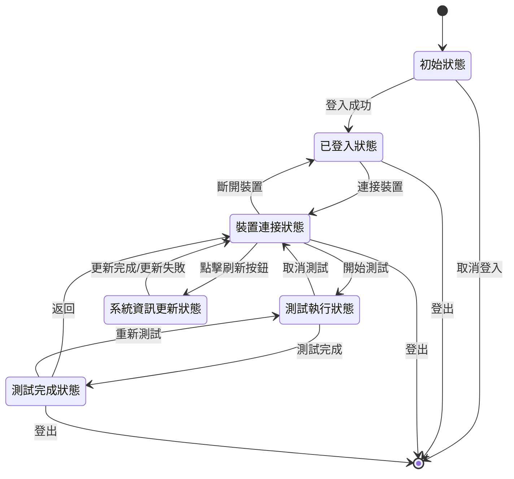

1. **初始狀態**：系統啟動，顯示裝置連線對話框

2. **已登入狀態**：使用者已登入，但尚未連接裝置

3. **裝置連接狀態**：
   - 已連接一個或多個裝置
   - 裝置資訊顯示在介面上
   - 可以執行測試操作或查看系統資訊

4. **系統資訊更新狀態**：
   - 點擊刷新按鈕後進入此狀態
   - 系統向裝置發送請求，獲取最新系統資訊
   - UI控制按鈕暫時禁用，避免重複操作
   - 更新完成或失敗後返回裝置連接狀態

5. **測試執行狀態**：
   - 測試正在執行中
   - UI顯示測試進度和中間結果
   - 使用者可以取消測試

6. **測試完成狀態**：
   - 測試執行完畢
   - 顯示測試結果和詳細資訊
   - 可以返回到裝置連接狀態或執行其他測試

狀態轉換由使用者操作和系統事件觸發，例如登入成功、裝置連接/斷開、測試開始/完成、刷新系統資訊等。每個狀態都有對應的UI反饋，確保使用者清楚了解當前系統狀態。

## 6. Auto Diagnostic 元件

Auto Diagnostic元件遵循MVC架構模式，用於執行和展示系統自動診斷功能。該元件整合了系統測試框架，實現了簡潔、可擴充的診斷功能。

### 6.1 架構設計

Auto Diagnostic元件由三個主要部分組成：

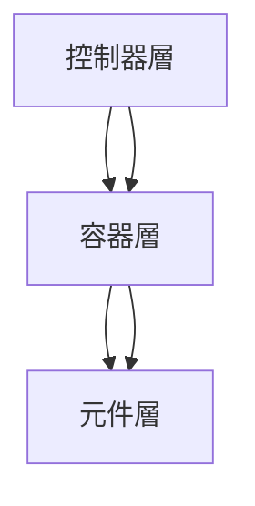

1. **控制器層（auto_diagnostic_view.py）**：
   - 管理整個診斷流程
   - 協調測試執行和結果處理
   - 處理使用者互動和事件
   - 整合`HardwareTestManagerService`進行測試

2. **容器層（diagnostic_container.py）**：
   - 管理多個診斷項目
   - 提供統一的捲動視圖
   - 處理診斷項目的佈局和顯示

3. **元件層（diagnostic_item_widget.py）**：
   - 呈現單個診斷項目
   - 顯示測試名稱、狀態指示和測試時間
   - 提供直觀的狀態視覺反饋

### 6.2 主要功能實作

1. **序列化測試執行**：
   - 實現一次執行一個測試的機制
   - 測試項目按序執行，避免資源衝突
   - 使用測試間延遲（300-500ms）確保資源釋放和系統穩定

   ```python
   def _start_test(self, test_id):
       """啟動單一測試"""
       logger.info(f"啟動診斷測試: {test_id}")
       
       try:
           # 新增短暫延時確保資源準備就緒
           QTimer.singleShot(300, lambda: self._execute_test(test_id))
       except Exception as e:
           logger.error(f"準備測試 {test_id} 時發生錯誤: {str(e)}")
           # 如果測試準備出錯，嘗試繼續下一個測試
           if hasattr(self, 'pending_tests') and self.pending_tests:
               next_test = self.pending_tests.pop(0)
               self._start_test(next_test)
   ```

2. **事件處理優化**：
   - 改進測試完成事件處理邏輯，防止重複處理
   - 忽略已完成測試的誤報取消訊息
   - 實現更可靠的測試結果處理

   ```python
   def _on_test_completed(self, test_id, success, message):
       """處理測試完成事件"""
       # 檢查測試ID是否在追蹤範圍
       if test_id not in self.current_diagnostics:
           return
       
       # 防止重複處理相同測試的完成事件
       if test_id in self.diagnostic_results and self.diagnostic_results[test_id]["status"] != "PENDING":
           logger.warning(f"收到測試 {test_id} 的重複完成事件，忽略處理。")
           return
       
       # 處理取消訊息
       if not success and "cancelled" in message.lower():
           # 如果測試已成功完成但收到取消訊息，則忽略此訊息
           if test_id in self.diagnostic_results and self.diagnostic_results[test_id]["status"] == "PASS":
               logger.warning(f"忽略已成功測試 {test_id} 的取消訊息")
               return
   ```

3. **UI與佈局**：
   - 診斷項目的直觀顯示
   - 測試狀態（PENDING/PASS/FAIL）以顏色區分
   - 支援測試執行時間顯示

### 6.3 與MainWindow整合

Auto Diagnostic組件作為獨立區域添加到Dashboard標籤中，而非作為System Overview的一部分：

```python
def _init_auto_diagnostic_view(self):
    """初始化自動診斷視圖設定"""
    # 建立自動診斷組件
    self.auto_diagnostic_widget = self.auto_diagnostic_view.create_widget()
    
    # 將自動診斷組件作為獨立區域添加到Dashboard標籤
    dashboard_layout = self.window.tab_dashboard.layout()
    if dashboard_layout:
        # 在系統概覽群組框之後添加自動診斷組件
        dashboard_layout.addWidget(self.auto_diagnostic_widget)
    else:
        # 如果Dashboard頁面沒有布局，建立新布局
        dashboard_layout = QVBoxLayout(self.window.tab_dashboard)
        dashboard_layout.addWidget(self.window.groupBox_system_overview)  # 先添加系統概覽
        dashboard_layout.addWidget(self.auto_diagnostic_widget)  # 再添加自動診斷
    
    # 設定自動診斷測試項目
    diagnostic_tests = {
        "usb_ports": "USB連接埠測試",
        "emmc": "eMMC測試",
        "eeprom": "EEPROM測試"
    }
    self.auto_diagnostic_view.setup_diagnostic_items(diagnostic_tests)
```

### 6.4 擴充性與維護

Auto Diagnostic元件設計具有高度的擴充性：

1. **簡化測試項管理**：
   - 透過修改測試項字典即可添加或移除診斷項
   - 無需修改UI設計文件，減少維護成本

2. **共享測試邏輯**：
   - 與`HardwareTestManagerService`共享測試邏輯
   - 利用現有測試框架，避免代碼重複

3. **未來改進方向**：
   - 為`DiagnosticContainer`添加移除測試項功能
   - 進一步優化測試間延遲機制
   - 增加測試中斷恢復功能
   - 提供更詳細的測試結果展示

這種MVC架構的設計使Auto Diagnostic元件能夠與系統其他部分保持一致的架構風格，提高了代碼的可維護性和擴充性，同時解決了之前測試執行中的問題。

## 7. 非同步處理機制

Orion系統採用Qt的信號槽機制和工作執行緒來實現非同步處理：

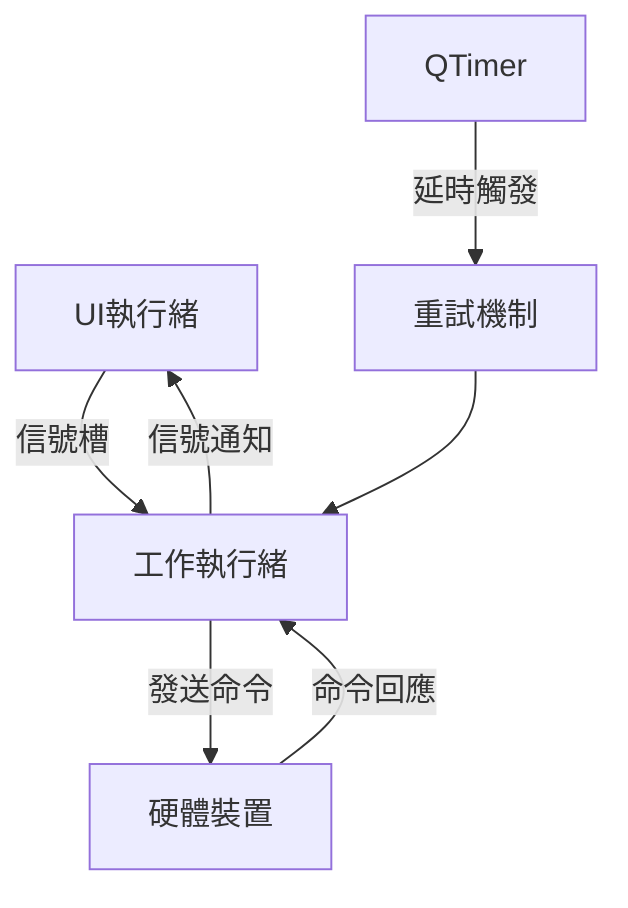

1. **工作執行緒**：
   - `SerialDeviceWorker`：處理裝置通訊，避免阻塞UI
   - 各種`TestWorker`：執行測試步驟，非同步處理測試邏輯

2. **信號槽連接**：
   - 工作執行緒透過信號通知UI更新
   - 例如：`test_step_completed`、`test_completed`等信號

3. **非同步命令執行**：
   - 命令發送到裝置後不阻塞
   - 透過回呼函數或信號處理命令結果

4. **重試機制**：
   - 測試步驟執行失敗時自動重試
   - 使用QTimer實現延時重試
   - 重試次數和間隔可配置

5. **測試間延遲處理**：
   - 在Auto Diagnostic組件中使用`QTimer.singleShot`實現測試間的延遲
   - 確保系統資源釋放和狀態穩定，避免測試互相干擾
   - 延遲時間可自訂（300-500ms），優化測試可靠性

## 8. 多裝置指令並行處理設計

Orion系統支援多裝置同時連線並進行並行操作，這種設計使系統能夠高效地管理多台設備同時進行測試和監控：

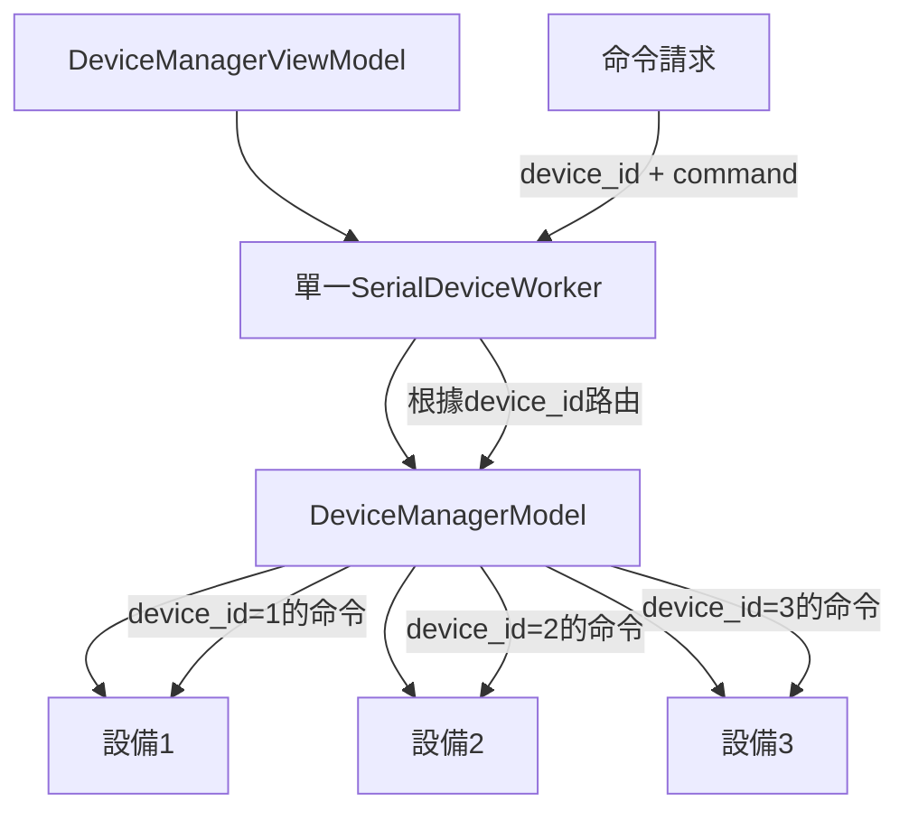

1. **集中式請求處理**：
   - 單一`SerialDeviceWorker`實例處理所有設備的命令請求
   - 使用設備ID（`device_id`）作為關鍵參數來區分目標設備
   - 減少線程數量，降低系統資源消耗

2. **指令路由機制**：
   - `DeviceManagerModel`維護一個設備字典（`devices`），使用設備ID作為鍵
   - 每個命令都包含設備ID參數，用於確定命令的目標設備
   - 命令執行結果通過信號返回時，同樣攜帶設備ID，確保回應能正確路由回對應的請求者

3. **設備隔離**：
   - 不同設備的操作互不影響，各自在獨立的串口通道上執行
   - 每個`SerialDeviceModel`實例都有自己的串口連接和緩衝區
   - 執行命令前重置輸入/輸出緩衝區，防止數據交叉污染

4. **並行但不並發**：
   - 系統支援多設備並行操作，但同一設備的命令按序執行
   - 設計預留了互斥鎖機制（`command_mutex`），可在需要時實現更精細的並發控制
   - 基於Qt的信號槽系統提供了事件序列化，確保命令處理的有序性

5. **系統資源管理**：
   - 集中式的工作線程減少了系統資源開銷
   - 避免了為每個設備創建單獨線程帶來的性能問題
   - 通過設備ID路由而非多線程實現並行處理，簡化了系統設計

這種設計使Orion系統能夠同時管理多台設備，確保各設備操作互不干擾，同時維持了良好的系統性能和資源利用率。

## 9. 擴充性設計

系統設計具有高度的可擴充性：

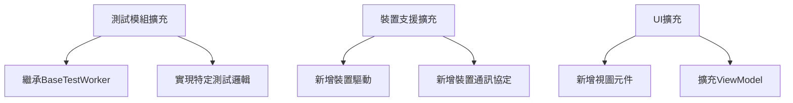

1. **模組化架構**：
   - 核心元件透過介面互動，低耦合
   - 可以獨立擴充或替換各個模組

2. **測試框架**：
   - `BaseTestWorker`提供通用測試框架
   - 新的測試類型只需繼承並實現特定方法

3. **裝置支援**：
   - 設計支援多種裝置類型
   - 可以方便地新增裝置驅動程式

4. **介面擴充**：
   - 基於MVVM模式，UI和業務邏輯分離
   - 可以輕鬆新增介面元件和功能

5. **Auto Diagnostic擴充**：
   - 透過修改診斷測試字典即可輕鬆新增或移除診斷項
   - 診斷項的UI表示與測試邏輯分離，便於獨立修改
   - 與TestManager共享測試邏輯，減少代碼重複

## 10. 開發指南：建立新測試模組

要建立一個新的測試模組，請按照以下步驟操作：

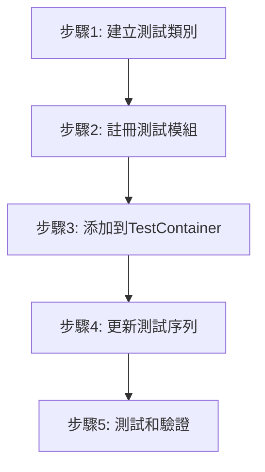

1. **建立測試工作執行緒類別**：
   
   在`core/tests/`目錄下建立新的測試工作執行緒類別，繼承自`BaseTestWorker`：

   ```python
   from core.tests.base_test_worker import BaseTestWorker, TestStep

   class NewModuleTestWorker(BaseTestWorker):
       """新模組測試工作執行緒"""
       
       def prepare_test_steps(self):
           """準備測試步驟"""
           steps = []
           
           # 新增測試步驟
           steps.append(TestStep(
               command="test_command_1",
               expected_response="expected_result_1",
               description="第一個測試步驟",
               timeout=5,
               max_retries=2
           ))
           
           # 新增帶有自訂驗證函數的測試步驟
           steps.append(TestStep(
               command="test_command_2",
               validation_func=self._validate_step_2,
               description="第二個測試步驟",
               timeout=10
           ))
           
           return steps
           
       def _validate_step_2(self, response):
           """驗證第二個測試步驟的結果"""
           if "success" in response:
               return True, "測試通過"
           else:
               return False, f"測試失敗: {response}"
   ```

2. **在測試管理程式中註冊**：

   在`HardwareTestManagerService`類別的`_register_test_workers`方法中註冊新的測試工作執行緒：

   ```python
   def _register_test_workers(self):
       """註冊所有模組測試工作執行緒"""
       # 現有測試模組
       from core.tests.usb_ports_test_worker import UsbPortsTestWorker
       self._register_worker("usb_ports", UsbPortsTestWorker, continue_on_failure=True)
       
       # 新增新的測試模組
       from core.tests.new_module_test_worker import NewModuleTestWorker
       self._register_worker("new_module", NewModuleTestWorker, continue_on_failure=True)
   ```

3. **將測試模組添加到TestContainer**：

   在`main_window.py`文件的`_init_functionality_test_ui`方法中，將新的測試模組添加到TestContainer：

   ```python
   def _init_functionality_test_ui(self):
       """Initialize functionality test UI elements"""
       # ... 原有程式碼 ...
       
       # 創建測試容器
       test_container = TestContainer()
       
       # ... 原有測試模組 ...
       
       # 添加新測試模組
       test_container.add_test_group("new_module", "New Module Test")
       
       # ... 原有程式碼 ...
   ```

4. **更新測試序列（如需要）**：

   如果希望將新測試模組添加到"測試全部"功能中，需要在`TestManagerView`類中更新`test_sequence`列表：

   ```python
   def __init__(self, device_id: str, hw_test_manager: HardwareTestManagerService):
       """初始化測試管理視圖"""
       # ... 其他初始化程式碼 ...
       
       # 更新測試序列，包含新模組
       self.test_sequence = [
           "usb_ports", "emmc", "eeprom", "battery", 
           "backlight", "led", "audio", "new_module"
       ]
   ```

5. **測試和驗證**：

   - 確保新模組按預期工作
   - 驗證測試步驟的執行和結果處理
   - 測試異常情況和邊界條件
   - 確認"測試全部"功能能正確包含新模組
   - 確保測試狀態和進度顯示正常

通過使用`TestContainer`的這種簡化方式，你可以更輕鬆地擴充Orion系統，無需修改UI設計文件，只需少量代碼即可添加新的測試功能。這種模塊化設計大大提高了系統的可維護性和擴展性。

## 11. 將新測試模組整合至Auto Diagnostic介面

當您遵循第十章步驟建立了新的測試模組後，可透過以下步驟將其整合至Auto Diagnostic介面，實現診斷功能的擴充：

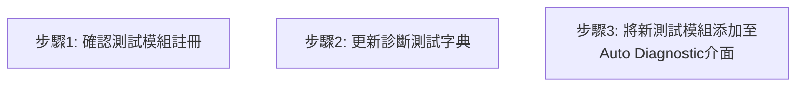

1. **確認測試模組註冊**：
   - 確保新測試模組已經在`HardwareTestManagerService`中註冊
   - 確認新測試模組的測試步驟和邏輯已經正確實現

2. **更新診斷測試字典**：
   - 將新測試模組添加至Auto Diagnostic介面的診斷測試字典中
   - 確保診斷測試字典包含所有已註冊的測試模組

3. **將新測試模組添加至Auto Diagnostic介面**：
   - 在Auto Diagnostic介面中實現新測試模組的顯示和執行
   - 確保新測試模組的測試步驟和結果處理能夠正常運行

這樣，您就可以將新測試模組整合至Auto Diagnostic介面，實現診斷功能的擴充。這種設計使Orion系統能夠高效地管理和執行多種測試，確保測試結果的準確性和可靠性。

## 12. 近期系統改進

系統在多個關鍵方面進行了優化和改進，特別是針對變量替換、平台命令集、系統日誌、測試進度和報告導出等功能。

### 12.1 變量替換優化

在`panel_id_resolution_worker.py`和其他測試工作線程中，命令字符串的變量占位符替換邏輯進行了優化，主要包含以下改進：

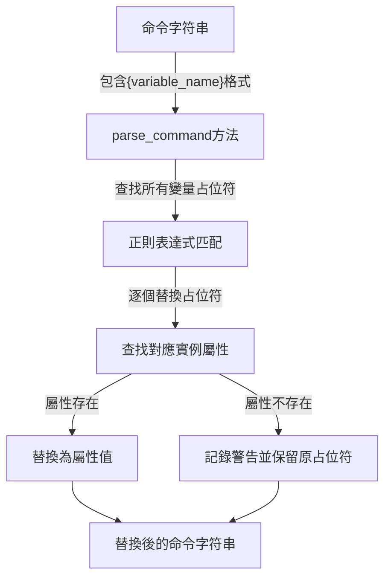

1. **變量解析機制優化**：
   - 使用正則表達式精確識別命令字符串中的`{variable_name}`格式占位符
   - 詳細的日誌記錄每個占位符及其替換過程
   - 改進錯誤處理，確保解析失敗時不會影響測試流程

2. **動態替換邏輯**：
   - 變量值在運行時透過測試步驟動態獲取和替換
   - 例如在`panel_id_resolution_worker.py`中，`process_id`變量在第一步執行後獲取，然後在執行第二步命令時動態替換

3. **空值和錯誤處理**：
   - 當變量值為`None`時提供警告並繼續處理
   - 列出可用的屬性以協助調試
   - 確保在替換過程中發生錯誤時能夠回退到原始命令

### 12.2 平台命令集改進

替換了硬編碼命令，實現了從JSON文件讀取命令集的`PlatformCommandSet`類，提高了系統靈活性：

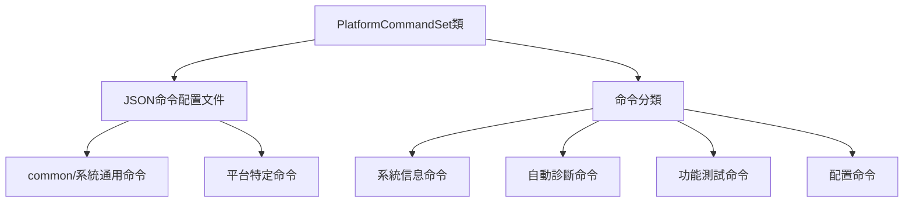

1. **多平台命令支持**：
   - 系統採用新的命令管理架構，支持不同平台的命令集
   - 透過JSON配置文件定義和管理命令，取代了原有的硬編碼方式
   - 支持共享命令（common目錄）和平台特定命令

2. **清晰的命令分類**：
   - 引入`CommandType`枚舉類型，清晰劃分不同類型的命令
   - 支持`SYSTEM_INFO`、`AUTO_DIAGNOSTIC`、`FUNCTIONALITY`和`CONFIGURATION`四種命令類型

3. **列表格式命令支持**：
   - 支持命令列表格式，允許一個測試項包含多個連續執行的命令
   - 提供`get_command`和`get_commands`方法靈活獲取單個或多個命令

4. **動態平台切換**：
   - 支持在運行時切換平台，動態加載對應平台的命令集
   - 添加平台名稱設置和獲取可用平台列表功能

### 12.3 系統日誌優化

改進了日誌記錄邏輯，確保命令和響應被清晰記錄：

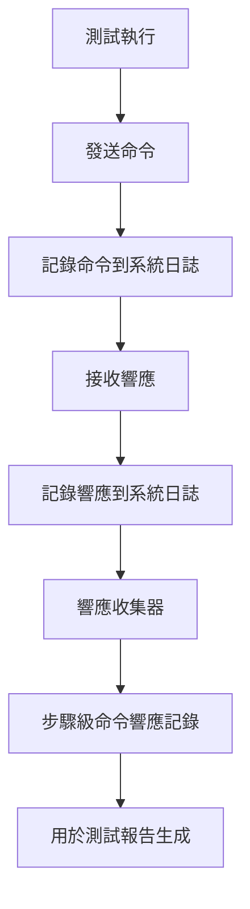

1. **明確的命令響應日誌**：
   - 在`BaseTestWorker`中確保所有測試步驟的命令和響應被明確記錄
   - 使用格式化的日誌前綴（如"[Response]"）使日誌更易讀和分析

2. **響應收集器機制**：
   - 添加`set_response_collector`方法，允許設置收集器回調函數收集命令響應
   - 收集器接收測試ID、步驟索引、命令和響應參數，用於後續報告生成

3. **日誌級別優化**：
   - 為不同類型的日誌信息設置適當的日誌級別
   - 確保關鍵信息（如錯誤和警告）被突出顯示，便於排查問題

4. **步驟記錄完整性**：
   - 確保每個測試步驟的開始、執行過程和結果都有完整記錄
   - 包含重試信息和驗證結果的詳細記錄

### 12.4 測試進度優化

修復了測試進度表中步驟信息顯示問題：

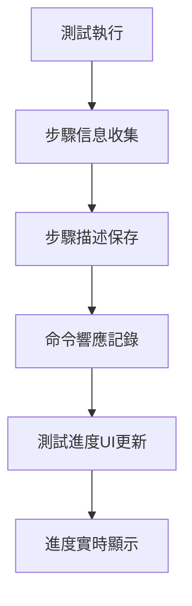

1. **步驟信息完整性**：
   - 改進了`TestStep`類，確保每個步驟都有明確的描述屬性
   - 測試步驟執行前後都保存完整的步驟信息，便於UI顯示和報告生成

2. **實時進度更新**：
   - 優化了進度信號機制，確保UI能實時反映當前測試進度
   - 添加了更詳細的進度信息，包括當前步驟索引、總步驟數和描述

3. **重試機制改進**：
   - 增強了步驟重試機制，清晰顯示重試次數和原因
   - 透過`test_step_retrying`信號向UI傳遞重試狀態

### 12.5 測試報告導出優化

修復了自動診斷和功能測試報告中缺少步驟、命令和響應信息問題：

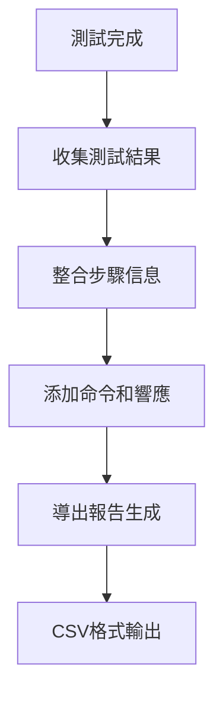

1. **步驟信息收集改進**：
   - 透過響應收集器機制收集每個步驟的命令和響應
   - 在`_on_test_step_completed`方法中收集步驟描述、狀態和結果

2. **報告數據結構優化**：
   - 改進報告數據結構，確保包含所有必要信息
   - 添加了步驟索引、描述、命令、響應和結果字段

3. **導出功能增強**：
   - 在`_export_test_results`和`_export_diagnostic_report`方法中正確獲取所有測試信息
   - 確保CSV報告包含完整的測試步驟和結果數據

4. **數據結構優化**：
   - 使用合理的数据結構存储測試結果和步驟信息
   - 確保數據的完整性和一致性，便於報告生成
   - 支持多種報告格式和內容定制

透過這些改進，系統能夠生成更加完整和詳細的測試報告，幫助用戶更好地了解測試過程和結果，便於問題診斷和分析。

### 12.6 設備管理器UI改進

改進了設備管理器UI，提升用户体验：

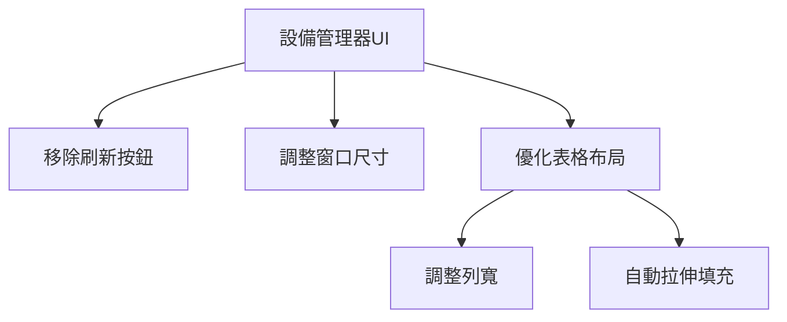

1. **移除冗余控件**：
   - 移除了刷新按鈕及相关邏輯，改為自動更新設備信息
   - 簡化了UI設計，減少不必要的用戶操作步驟

2. **窗口尺寸優化**：
   - 調整了窗口默認尺寸和最小尺寸限制（640×400）
   - 確保所有信息都能在合理的窗口大小內完整顯示

3. **表格布局改進**：
   - 優化了設備表格的列寬設置，確保關鍵信息不被截斷
     - 設備名稱列寬: 150px
     - 設備類型列寬: 100px
     - 設備地址列寬: 200px
     - 設備狀態列寬: 120px
   - 設置表格水平表頭自動拉伸最后一節，更好地利用可用空間

4. **響應式布局**：
   - 實現了更好的響應式布局，確保UI元素在窗口調整時保持合理的比例
   - 添加內容邊距設置，提升視覺體驗

## 14. 用戶旅程優化

系統用戶旅程進行了優化，特別是從設備連接到執行自動診斷測試的流程：

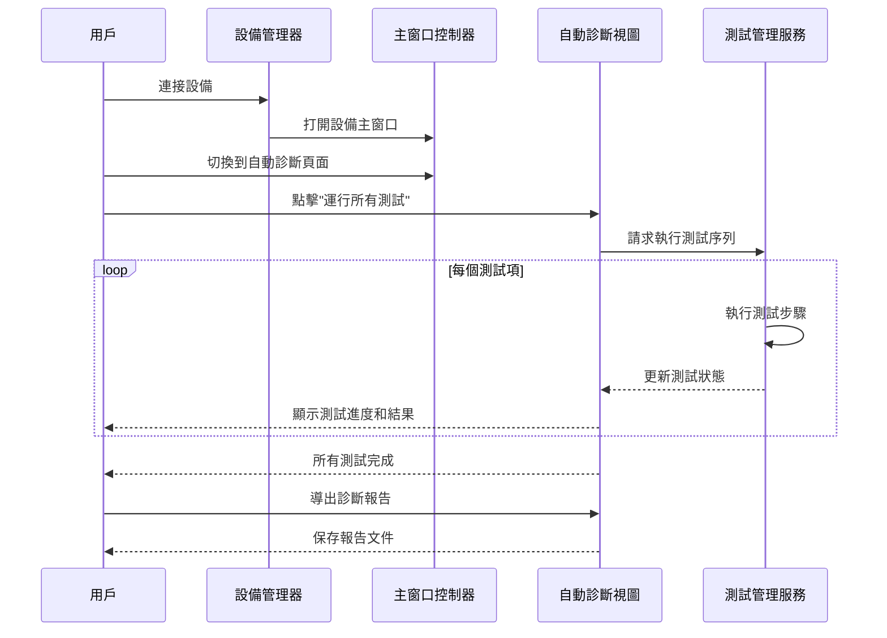

1. **簡化的設備連接**：
   - 設備管理器界面進行了優化，提供更直觀的設備連接體驗
   - 移除了冗余的刷新按鈕，減少用戶操作步驟

2. **自動診斷流程改進**：
   - 診斷測試項目更加清晰，提供詳細描述
   - 測試執行過程中實時顯示進度和狀態
   - 優化了測試順序，確保測試項目按邏輯順序執行

3. **測試結果呈現優化**：
   - 測試結果使用更清晰的顏色和狀態標識
   - 提供測試執行時間信息，幫助評估測試效率
   - 支持詳細的測試日誌查看，便於診斷問題

4. **報告導出增強**：
   - 改進的報告導出功能，包含完整的測試步驟和結果
   - 支持CSV格式導出，便於進一步分析和處理
   - 报告中包含設備信息、測試時間和詳細的測試步驟數據

5. **測試中斷和恢復**：
   - 增強的測試中斷和恢復機制，提高測試的可靠性
   - 支持在測試過程中取消或暫停測試

## 15. 響應收集與報告生成

新增了響應收集機制，以改進報告生成功能，確保測試報告包含完整信息：

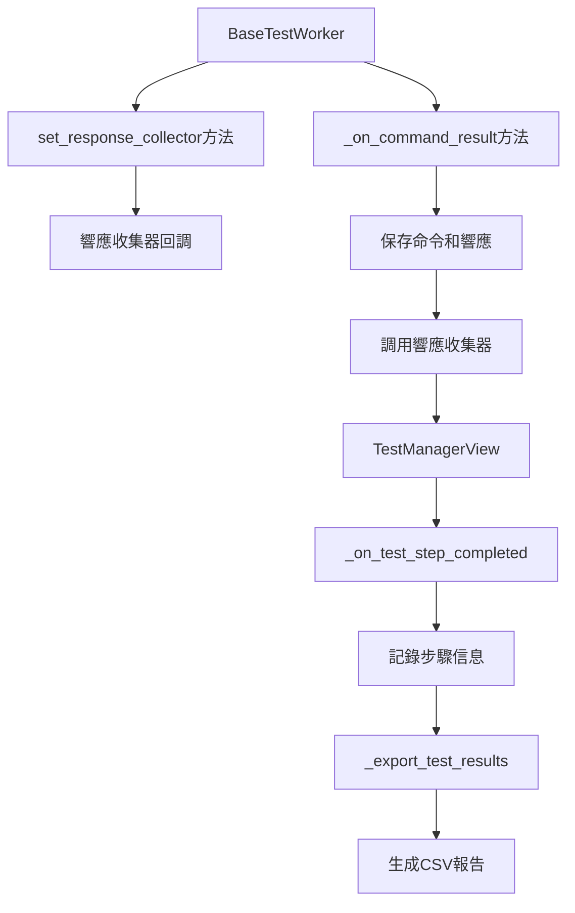

1. **響應收集器設計**：
   - 在`BaseTestWorker`中添加了`set_response_collector`方法，允許設置收集器回調函數
   - 收集器函數接收`test_id`、`step_index`、`command`和`response`參數
   - 在命令執行完成後自動調用收集器，記錄詳細信息

2. **步驟信息收集**：
   - 在`_on_test_step_completed`方法中收集每個步驟的詳細信息
   - 保存步驟描述、命令、響應、執行狀態和結果
   - 建立測試ID、步驟索引與相關信息的映射關係

3. **報告生成改進**：
   - 在`_export_test_results`和`_export_diagnostic_report`方法中整合收集的信息
   - 生成包含完整測試步驟、命令和響應的CSV格式報告
   - 按照測試執行順序組織報告內容

4. **數據結構優化**：
   - 使用合理的数据結構存储測試結果和步驟信息
   - 確保數據的完整性和一致性，便於報告生成
   - 支持多種報告格式和內容定制

透過這些改進，系統能夠生成更加完整和詳細的測試報告，幫助用戶更好地了解測試過程和結果，便於問題診斷和分析。

## 16. 未來發展方向

基於當前的系統改進，以下是未來可能的發展方向：

1. **自動化測試擴展**：
   - 進一步擴展自動診斷測試項目，覆蓋更多硬件組件
   - 實現更複雜的測試場景和條件測試

2. **UI體驗優化**：
   - 進一步改進用戶界面，提供更直觀的操作體驗
   - 添加自定義主題和外觀設置選項

3. **報告功能增強**：
   - 添加更多報告格式支持，如PDF或HTML格式
   - 實現測試報告的歷史記錄和比較功能

4. **遠程測試支持**：
   - 添加遠程設備測試和監控功能
   - 支持透過網絡連接管理和測試設備

5. **測試用例管理**：
   - 添加測試用例管理功能，支持自定義測試序列
   - 實現測試用例的導入、導出和共享

6. **多語言支持**：
   - 添加多語言界面支持，包括中文、英文等
   - 實現語言設置和切換功能

這些發展方向將進一步提升系統的功能性、易用性和擴展性，滿足更多用戶的需求和場景。

## 17. 測試資料記錄與報告導出流程

本章節詳細說明 Orion 系統中 functionality 測試和 auto diagnostic 測試的資料記錄機制以及最終報告導出的完整流程。

### 16.1 整體架構流程

```mermaid
graph TD
    A[測試開始] --> B[步驟模板保存]
    B --> C[測試步驟執行]
    C --> D[命令響應記錄]
    D --> E[步驟結果記錄]
    E --> F[測試進度更新]
    F --> G{測試是否完成?}
    G -->|否| C
    G -->|是| H[測試結果彙整]
    H --> I[報告導出]
    I --> J[CSV檔案生成]
```

### 16.2 詳細資料流向

```mermaid
sequenceDiagram
    participant BT as BaseTestWorker
    participant TM as TestManager/AutoDiagnostic
    participant MC as MainWindowController
    participant Storage as 統一資料存儲
    participant Export as 報告導出器
    
    Note over BT,MC: 階段1: 測試啟動與模板保存
    BT->>MC: test_started信號(test_id)
    MC->>Storage: 保存步驟模板到test_step_templates
    
    Note over BT,MC: 階段2: 步驟執行與記錄
    loop 每個測試步驟
        BT->>BT: 執行測試步驟
        BT->>BT: _on_command_result處理響應
        BT->>TM: test_step_completed信號
        TM->>MC: record_test_result調用
        MC->>Storage: 更新unified_test_results
        TM->>MC: record_test_progress調用  
        MC->>Storage: 更新unified_test_progress
    end
    
    Note over BT,MC: 階段3: 報告導出
    MC->>Export: _export_results調用
    Export->>Storage: 讀取test_step_templates
    Export->>Storage: 讀取unified_test_results
    Export->>Storage: 讀取unified_test_progress
    Export->>Export: 資料整合與過濾
    Export->>Export: 生成CSV報告
```

### 16.3 資料存儲結構

#### 16.3.1 統一測試結果存儲 (unified_test_results)

```python
self.unified_test_results = {
    "functionality": {
        "functionality_touch": {
            "status": "completed",
            "steps": [
                {
                    "index": 0,
                    "description": "Launch ts_test",
                    "message": "PASS",
                    "command": "ts_test_mt -j 2 -v",
                    "response": "Test output...",
                    "time": "00:00:05",
                    "criteria": "Test should launch successfully",
                    "specification": "Touch test specification"
                },
                # ... 更多步驟
            ]
        }
    },
    "diagnostic": {
        "diagnostic_cpu_name": {
            "status": "completed", 
            "steps": [
                {
                    "index": 0,
                    "description": "Check CPU Name",
                    "message": "PASS",
                    "command": "cat /proc/cpuinfo | grep 'model name'",
                    "response": "model name: ARM Cortex-A7",
                    "time": "00:00:02",
                    "criteria": "CPU name should be detected",
                    "specification": "CPU detection specification"
                }
            ]
        }
    }
}
```

#### 16.3.2 測試進度記錄 (unified_test_progress)

```python
self.unified_test_progress = {
    "functionality": {
        "functionality_touch": [
            {
                "current_step": 1,
                "total_steps": 13,
                "timestamp": "2025-05-23 15:30:00",
                "status": "executing"
            },
            {
                "current_step": 2, 
                "total_steps": 13,
                "timestamp": "2025-05-23 15:30:05",
                "status": "completed"
            }
            # ... 更多進度記錄
        ]
    },
    "diagnostic": {
        "diagnostic_cpu_name": [
            {
                "current_step": 1,
                "total_steps": 1,
                "timestamp": "2025-05-23 15:25:00",
                "status": "completed"
            }
        ]
    }
}
```

#### 16.3.3 步驟模板存儲 (test_step_templates)

```python
self.test_step_templates = {
    "functionality": {
        "functionality_touch": [
            {
                "index": 0,
                "description": "Launch ts_test",
                "criteria": "Test should launch successfully",
                "command": "ts_test_mt -j 2 -v",
                "manual_only": False,
                "specification": "Touch test specification",
                "pre_condition": "",
                "post_check": ""
            },
            {
                "index": 1,
                "description": "Touch the 9 points",
                "criteria": "User should touch all 9 points correctly",
                "command": "",
                "manual_only": True,
                "specification": "Manual interaction test",
                "pre_condition": "Ensure screen is clean",
                "post_check": "Verify all 9 points were touched"
            }
            # ... 更多步驟模板
        ]
    },
    "diagnostic": {
        "diagnostic_cpu_name": [
            {
                "index": 0,
                "description": "Check CPU Name", 
                "criteria": "CPU name should be detected",
                "command": "cat /proc/cpuinfo | grep 'model name'",
                "manual_only": False,
                "specification": "CPU detection specification"
            }
        ]
    }
}
```

### 16.4 關鍵記錄節點

#### 16.4.1 測試啟動記錄

```python
@Slot(str)
def _on_test_started(self, test_id: str):
    """處理測試啟動事件，保存步驟模板資訊"""
    try:
        # 從 hardware test manager 獲取當前 active worker 的步驟資訊
        if hasattr(self.hw_test_manager, 'active_test_worker') and self.hw_test_manager.active_test_worker:
            worker = self.hw_test_manager.active_test_worker
            
            if hasattr(worker, 'steps') and worker.steps:
                # 保存步驟模板資訊
                step_templates = []
                for i, step in enumerate(worker.steps):
                    step_template = {
                        'index': i,
                        'description': getattr(step, 'description', ''),
                        'criteria': getattr(step, 'criteria', ''),
                        'command': getattr(step, 'command', ''),
                        'manual_only': getattr(step, 'manual_only', False),
                        'specification': getattr(step, 'specification', ''),
                    }
                    step_templates.append(step_template)
                
                # 確定測試類型並保存模板
                test_type = "functionality" if test_id.startswith("functionality_") else "diagnostic"
                self.test_step_templates[test_type][test_id] = step_templates
                
                logger.info(f"Saved {len(step_templates)} step templates for {test_id}")
```

#### 16.4.2 步驟完成記錄

在 `test_manager.py` 中的 `_on_test_step_completed` 方法：

```python
def _on_test_step_completed(self, step_index: int, success: bool, message: str):
    """處理測試步驟完成事件"""
    # 獲取當前測試資訊
    current_test_id = self.hw_test_manager.active_test_id
    
    # 記錄步驟結果
    if current_test_id in self.local_temp_results:
        # 從 active worker 獲取詳細步驟資訊
        step_data = {
            "index": step_index,
            "success": success,
            "message": self._determine_final_message(message, success),
            "description": self._get_step_description(step_index),
            "command": self._get_step_command(step_index),
            "response": self._get_step_response(step_index),
            "criteria": self._get_step_criteria(step_index),
            "specification": self._get_step_specification(step_index),
            "time": self._calculate_step_time(step_index)
        }
        
        # 檢查是否已存在相同索引的步驟記錄，若存在則更新
        self._update_or_add_step_record(current_test_id, step_data)
```

#### 16.4.3 統一資料記錄

```python
def record_test_result(self, test_type, test_id, result_data):
    """記錄測試結果到統一存儲"""
    if test_type in self.unified_test_results:
        self.unified_test_results[test_type][test_id] = result_data
        logger.debug(f"Recorded test result for {test_type}/{test_id}")

def record_test_progress(self, test_type, test_id, progress_data):
    """記錄測試進度到統一存儲"""
    if test_type in self.unified_test_progress:
        if test_id not in self.unified_test_progress[test_type]:
            self.unified_test_progress[test_type][test_id] = []
        self.unified_test_progress[test_type][test_id].append(progress_data)
        logger.debug(f"Recorded test progress for {test_type}/{test_id}")
```

### 16.5 報告導出機制

#### 16.5.1 導出流程概述

```mermaid
graph TD
    A[用戶點擊導出] --> B[_export_results方法]
    B --> C[獲取測試結果資料]
    C --> D[獲取步驟模板資料]
    D --> E[獲取進度記錄資料]
    E --> F[資料整合與驗證]
    F --> G[響應內容過濾]
    G --> H[CSV格式化]
    H --> I[檔案保存]
    I --> J[清理測試資料]
```

#### 16.5.2 雙階段資料處理

**階段1: 處理有進度記錄的測試**

```python
# 處理有進度記錄的測試（已執行的測試）
for test_id, records in test_progress_records.items():
    # 確定測試類型
    test_type = "diagnostic" if test_id.startswith("diagnostic_") else "functionality"
    step_templates = self.test_step_templates.get(test_type, {}).get(test_id, [])
    
    # 獲取實際執行的測試步驟資料
    test_steps = []
    if test_id in test_results:
        test_steps = test_results[test_id].get("steps", [])
    elif test_id in diagnostic_results:
        test_steps = diagnostic_results[test_id].get("steps", [])
    
    # 基於步驟模板導出，確保所有有criteria的步驟都被導出
    for template_index, template in enumerate(step_templates):
        if not template.get('criteria', ''):
            continue  # 跳過無criteria的步驟
            
        # 從實際執行資料中獲取結果
        step_result = self._get_step_result_from_execution(template_index, test_steps)
        
        # 整合模板資訊與執行結果
        final_row_data = self._merge_template_and_execution_data(template, step_result)
        
        # 寫入CSV
        writer.writerow(final_row_data)
```

**階段2: 響應內容智能過濾**

```python
def _filter_response_content(self, step_response, is_manual_step=False):
    """智能過濾響應內容"""
    if is_manual_step:
        return step_response  # 手動步驟保持原始響應
    
    final_response = ""
    if isinstance(step_response, str):
        for line in step_response.split("\n"):
            line_stripped = line.strip()
            if not line_stripped:
                continue
                
            # 過濾明顯的命令行和控制資訊
            if any(filter_str in line_stripped for filter_str in ["i2ctransfer", "grep", "............"]):
                continue
                
            # 智能過濾命令提示符：只過濾明顯的提示符行
            if (line_stripped.startswith("#") or line_stripped.startswith("$") or line_stripped.startswith(">") or
                line_stripped.endswith("#") or line_stripped.endswith("$") or line_stripped.endswith(">")):
                continue
                
            # 過濾空的提示符行
            if line_stripped in ["#", "$", ">", "# ", "$ ", "> "]:
                continue
                
            final_response += line + "\n"
    
    return final_response.strip()
```

#### 16.5.3 CSV報告格式

最終生成的CSV報告包含以下欄位：

| 欄位名稱 | 說明 | 範例 |
|---------|------|------|
| Module | 測試模組名稱 | functionality_touch |
| Step | 步驟描述 | Touch the 9 points |
| Criteria | 測試標準 | User should touch all 9 points correctly |
| Result | 測試結果 | PASS/FAIL/SKIPPED |
| Command | 執行命令 | ts_test_mt -j 2 -v |
| Response | 命令響應 | Test completed successfully |
| Timestamp | 執行時間戳 | 2025-05-23 15:30:00 |
| Duration (sec) | 執行時長 | 00:00:05 |

#### 16.5.4 資料清理機制

```python
def clear_all_test_results(self):
    """清理所有測試資料"""
    # 清理測試結果
    for test_type in self.unified_test_results:
        self.unified_test_results[test_type].clear()
        self.unified_test_progress[test_type].clear()
    
    # 清理步驟模板
    for test_type in self.test_step_templates:
        self.test_step_templates[test_type].clear()
    
    # 通知視圖重置UI
    if hasattr(self, 'test_manager'):
        self.test_manager.reset_ui()
    if hasattr(self, 'auto_diagnostic_view'):
        self.auto_diagnostic_view.reset_ui()
        
    logger.info("All test results and templates cleared after export")
```

### 16.6 關鍵設計決策

#### 16.6.1 為什麼使用步驟模板系統？

1. **完整性保證**：確保所有定義的測試步驟都被記錄，即使某些步驟因為系統問題沒有完整執行
2. **標準化資訊**：提供統一的步驟描述、標準和規格資訊
3. **手動步驟支援**：特別處理需要人工驗證的手動交互步驟

#### 16.6.2 雙重資料來源整合

1. **步驟模板**：提供完整的步驟定義和標準
2. **執行記錄**：提供實際的執行結果和響應
3. **智能整合**：優先使用執行記錄，模板作為備援和補充

#### 16.6.3 響應過濾策略

1. **保護重要資訊**：避免過濾掉包含特殊字符但實際上是有效響應的內容（如`uname -a`中的`#1`）
2. **清理冗餘資訊**：移除命令提示符和控制字符，提高報告可讀性
3. **手動步驟特殊處理**：保持手動驗證步驟的原始響應

### 16.7 故障排除與調試

#### 16.7.1 常見問題

1. **步驟模板未保存**：
   - 檢查`test_started`信號是否正確發送
   - 驗證worker的steps屬性是否正確設置

2. **執行結果丟失**：
   - 確認`record_test_result`和`record_test_progress`被正確調用
   - 檢查test_id匹配是否正確

3. **響應內容為空**：
   - 檢查響應過濾邏輯是否過於嚴格
   - 確認命令執行是否成功返回響應

#### 16.7.2 調試工具

系統提供詳細的日誌記錄來協助調試：

```python
# 步驟模板保存日誌
logger.info(f"Saved {len(step_templates)} step templates for {test_id}")

# 步驟執行日誌  
logger.info(f"Step {template_index} final export: '{step_desc}' -> Result: '{step_message}'")

# 導出處理日誌
logger.info(f"Processing test with progress records: {test_id}, progress records: {len(records)}, step templates: {len(step_templates)}")
```

透過這套完整的記錄與導出機制，Orion系統能夠生成詳細、準確的測試報告，為用戶提供全面的測試結果分析和問題診斷支援。

## 13. 連接檢查機制

為了提高系統的可靠性和用戶體驗，Orion系統新增了完整的連接檢查機制，確保在執行關鍵操作前設備連接狀態正常。該機制包含智能連接監控、前置檢查服務和登錄狀態檢測等功能。

### 13.1 系統架構概述

連接檢查機制由三個核心組件組成：

```mermaid
graph TD
    A[SmartConnectionMonitor] --> B[ConnectionPreCheckService]
    B --> C[MainWindow Operations]
    A --> D[DeviceManagerViewModel]
    
    A1[智能連接監控] --> A
    B1[前置檢查服務] --> B
    C1[主要操作執行] --> C
    
    E[設備狀態檢測]
    F[登錄狀態識別]
    G[重試機制管理]
    
    A --> E
    A --> F
    A --> G
```

1. **SmartConnectionMonitor**：智能連接監控器，持續監控設備連接狀態
2. **ConnectionPreCheckService**：前置檢查服務，在執行主要操作前進行連接驗證
3. **設備狀態管理**：整合到DeviceManagerViewModel中，提供統一的設備狀態管理

### 13.2 SmartConnectionMonitor 智能連接監控

#### 13.2.1 核心功能

SmartConnectionMonitor提供持續的設備連接監控，具有以下特點：

```mermaid
graph TD
    A[SmartConnectionMonitor] --> B[健康檢查命令]
    B --> C[響應驗證]
    C --> D[登錄狀態檢測]
    D --> E[設備狀態更新]
    E --> F[信號發送]
    
    G[設備忙碌狀態管理]
    H[唯一命令標識符]
    I[精確信號過濾]
    
    A --> G
    A --> H
    A --> I
```

1. **零干擾監控**：
   - 通過設備忙碌狀態管理，避免與正在執行的測試衝突
   - 使用唯一命令標識符確保響應的準確匹配
   - 精確的信號過濾機制，防止命令交錯

2. **登錄狀態檢測**：
   ```python
   def _is_valid_monitor_response(self, expected_response: str, actual_response: str) -> bool:
       """驗證監控命令的響應"""
       # 檢查預期的唯一標識符是否在響應中
       if expected_response in actual_response:
           return True
           
       # 檢查登錄相關指示器（設備需要認證）
       login_indicators = ["Password:", "Login incorrect", "gemini login:", "login:", "Username:"]
       response_lower = actual_response.lower()
       for login_indicator in login_indicators:
           if login_indicator.lower() in response_lower:
               logger.warning(f"Device requires authentication: {actual_response.strip()}")
               return False
       
       return False
   ```

3. **智能重試機制**：
   - 預設最大失敗次數為1，失敗後立即報告連接問題
   - 移除複雜的重試邏輯，提供快速的失敗反饋
   - 設備連接恢復時自動重置失敗計數器

#### 13.2.2 設備狀態信號

SmartConnectionMonitor提供以下關鍵信號：

```python
# 設備準備就緒信號
device_ready_for_commands = Signal(str)  # device_id

# 設備連接丟失信號  
device_connection_lost = Signal(str, str)  # device_id, reason
```

### 13.3 ConnectionPreCheckService 前置檢查服務

#### 13.3.1 工作流程

ConnectionPreCheckService在執行主要操作前進行連接驗證：

```mermaid
sequenceDiagram
    participant User as 用戶
    participant MW as MainWindow
    participant PCS as ConnectionPreCheckService
    participant SCM as SmartConnectionMonitor
    participant Op as 目標操作
    
    User->>MW: 點擊操作按鈕
    MW->>PCS: execute_with_pre_check()
    PCS->>SCM: 啟動短暫連接監視
    SCM->>SCM: 發送健康檢查命令
    
    alt 連接正常
        SCM-->>PCS: 設備狀態正常
        PCS->>SCM: 停止監視
        PCS->>Op: 執行目標操作
        Op-->>MW: 操作完成
        MW-->>User: 顯示結果
    else 連接失敗
        SCM-->>PCS: 設備連接失敗
        PCS->>SCM: 停止監視
        PCS-->>MW: 前置檢查失敗
        MW-->>User: 顯示錯誤訊息
    end
```

#### 13.3.2 核心方法實現

```python
def execute_with_pre_check(self, device_id: str, operation_name: str, 
                          operation_callback, on_success=None, on_failure=None, 
                          timeout: int = 15):
    """執行帶前置檢查的操作"""
    
    # 檢查是否已有待處理的操作
    if device_id in self.pending_operations:
        logger.warning(f"Device {device_id} already has a pending pre-check operation")
        return False
    
    # 記錄操作資訊
    self.pending_operations[device_id] = {
        'operation_name': operation_name,
        'operation_callback': operation_callback,
        'on_success': on_success,
        'on_failure': on_failure,
        'timeout': timeout,
        'start_time': time.time()
    }
    
    # 啟動監視和超時處理
    self._start_monitoring_if_needed(device_id)
    self._setup_timeout_handler(device_id, timeout)
    
    return True
```

#### 13.3.3 錯誤處理機制

前置檢查服務具有完善的錯誤處理機制：

```python
def _handle_check_failure(self, device_id: str, reason: str):
    """處理檢查失敗"""
    if device_id not in self.pending_operations:
        return
        
    operation_info = self.pending_operations[device_id]
    operation_name = operation_info['operation_name']
    
    logger.error(f"Pre-check failed for {operation_name} on device {device_id}: {reason}")
    
    # 停止監控
    self._stop_monitoring_if_needed(device_id)
    
    # 發送失敗信號
    self.pre_check_failed.emit(device_id, reason)
    self.pre_check_completed.emit(device_id, False)
    
    # 調用失敗回調
    if operation_info['on_failure']:
        operation_info['on_failure'](reason)
    
    # 清理操作記錄
    del self.pending_operations[device_id]
```

### 13.4 主要操作整合

#### 13.4.1 系統資訊刷新

系統資訊刷新操作完全整合了前置檢查機制：

```python
def _on_refresh_system_info(self):
    """處理刷新按鈕點擊，帶前置連接檢查"""
    # 檢查是否已經在更新中，避免重複執行
    if hasattr(self, 'is_updating') and self.is_updating:
        logger.debug("System info update already in progress, ignoring duplicate request")
        return
    
    # 記錄當前標籤頁
    if hasattr(self.window, 'tabWidget'):
        self.current_tab_index = self.window.tabWidget.currentIndex()
    
    # 添加日誌記錄
    self.log_manager.add_log_entry("INFO", f"Checking connection before refreshing system info for {self.device_id}...")
    
    # 使用前置檢查執行系統資訊刷新
    success = self.connection_pre_check.execute_with_pre_check(
        device_id=self.device_id,
        operation_name="System Info Refresh",
        operation_callback=self._execute_system_info_refresh,
        on_success=self._on_system_info_pre_check_success,
        on_failure=self._on_system_info_pre_check_failure,
        timeout=12
    )
```

#### 13.4.2 功能測試和自動診斷

功能測試和自動診斷也整合了前置檢查：

```python
def execute_functionality_test_with_pre_check(self, test_id: str):
    """執行帶前置檢查的功能測試"""
    success = self.connection_pre_check.execute_with_pre_check(
        device_id=self.device_id,
        operation_name=f"Functionality Test: {test_id}",
        operation_callback=lambda: self.test_manager.start_test(test_id),
        timeout=15
    )
    
    if not success:
        self._show_pre_check_error("功能測試", "無法啟動前置檢查")

def execute_auto_diagnostic_with_pre_check(self):
    """執行帶前置檢查的自動診斷"""
    success = self.connection_pre_check.execute_with_pre_check(
        device_id=self.device_id,
        operation_name="Auto Diagnostic",
        operation_callback=lambda: self.auto_diagnostic_view.run_all_tests(),
        timeout=15
    )
    
    if not success:
        self._show_pre_check_error("自動診斷", "無法啟動前置檢查")
```

### 13.5 UI整合和用戶體驗

#### 13.5.1 防止並行執行

系統添加了`is_updating`標誌來防止並行執行：

```python
def _on_refresh_system_info(self):
    """處理刷新按鈕點擊，帶前置連接檢查"""
    # 檢查是否已經在更新中，避免重複執行
    if hasattr(self, 'is_updating') and self.is_updating:
        logger.debug("System info update already in progress, ignoring duplicate request")
        return
    
    # 設置更新狀態
    self.is_updating = True
    self.set_ui_controls_state_except_tabs(False)
```

#### 13.5.2 錯誤訊息顯示

前置檢查失敗時顯示統一的黑底樣式錯誤訊息：

```python
def _on_system_info_pre_check_failure(self, reason: str):
    """系統資訊刷新前置檢查失敗回調"""
    self.log_manager.add_log_entry("ERROR", f"Connection check failed for system info refresh: {reason}")
    
    # 停止可能正在進行的系統資訊更新
    if hasattr(self.view_model, 'system_info_service') and self.view_model.system_info_service:
        self.view_model.system_info_service.stop_update(self.device_id)
    
    # 恢復UI狀態
    self.is_updating = False
    self.set_ui_controls_state_except_tabs(True)
    
    # 顯示錯誤訊息
    msg_box = QMessageBox(self.window)
    msg_box.setWindowTitle("Connection Check Failed")
    msg_box.setText("Device connection check failed before refreshing system info.")
    msg_box.setDetailedText(f"Reason: {reason}")
    msg_box.setIcon(QMessageBox.Warning)
    msg_box.setStyleSheet(self._get_dark_message_box_style())
    msg_box.exec()
```

### 13.6 系統資訊服務改進

#### 13.6.1 停止更新功能

SystemInfoService新增了停止更新的功能：

```python
def stop_update(self, device_id: str = None):
    """
    停止正在進行的系統資訊更新
    
    Args:
        device_id: 要停止的設備ID，如果為None則停止當前更新
    """
    if device_id and device_id != self.current_device_id:
        logger.debug(f"No active update for device {device_id}")
        return
        
    if self.is_updating:
        logger.info(f"Stopping system info update for device: {self.current_device_id}")
        
        # 清除待執行的命令
        self.pending_commands.clear()
        
        # 重置更新狀態
        self.is_updating = False
        self.current_device_id = None
        self.collected_info = {}
        
        logger.debug("System info update stopped successfully")
    else:
        logger.debug("No active system info update to stop")
```

#### 13.6.2 按鈕連接優化

移除了SystemInfoManager中的直接按鈕連接，統一由MainWindow處理：

```python
# 不再直接連接刷新按鈕，讓main_window.py來處理前置檢查
# Connect refresh button
# if "refresh_button" in components and isinstance(components["refresh_button"], QPushButton):
#     components["refresh_button"].clicked.connect(self.refresh_system_info)
```

### 13.7 DeviceManagerViewModel整合

#### 13.7.1 監控器初始化

SmartConnectionMonitor整合到DeviceManagerViewModel中：

```python
def _initialize_smart_connection_monitor(self):
    """初始化智能連接監控器"""
    if not self.smart_connection_monitor:
        self.smart_connection_monitor = SmartConnectionMonitor()
        
        # 連接信號
        self.smart_connection_monitor.device_ready_for_commands.connect(
            self._on_device_ready_for_commands
        )
        self.smart_connection_monitor.device_connection_lost.connect(
            self._on_device_connection_lost
        )
        
        logger.info("Smart connection monitor initialized")

def start_monitoring_device(self, device_id: str):
    """開始監控指定設備"""
    if self.smart_connection_monitor:
        self.smart_connection_monitor.start_monitoring(device_id)
        logger.info(f"Started monitoring device: {device_id}")

def stop_monitoring_device(self, device_id: str):
    """停止監控指定設備"""
    if self.smart_connection_monitor:
        self.smart_connection_monitor.stop_monitoring(device_id)
        logger.info(f"Stopped monitoring device: {device_id}")
```

### 13.8 關鍵設計決策

#### 13.8.1 為什麼選擇前置檢查模式？

1. **用戶體驗優化**：避免用戶在設備未連接時等待操作超時
2. **資源保護**：防止在設備不可用時啟動資源密集的操作
3. **錯誤預防**：提前發現連接問題，提供明確的錯誤訊息

#### 13.8.2 登錄狀態檢測的重要性

1. **設備重啟場景**：設備重啟後通常需要重新登錄
2. **自動識別**：系統能自動識別"Password:"、"Login incorrect"等登錄提示
3. **快速失敗**：避免在需要登錄時無限等待

#### 13.8.3 移除複雜重試機制

1. **簡化邏輯**：移除複雜的重試和分段失敗處理
2. **快速反饋**：失敗後立即報告，不進行多次重試
3. **用戶控制**：讓用戶決定何時重新嘗試操作

### 13.9 故障排除

#### 13.9.1 常見問題

1. **前置檢查超時**：
   - 檢查設備是否真的連接
   - 確認設備是否需要登錄
   - 檢查網絡連接狀態

2. **重複執行問題**：
   - 確認`is_updating`標誌正確設置
   - 檢查是否有多個地方觸發相同操作

3. **監控器未啟動**：
   - 確認設備連接後調用了`start_monitoring_device`
   - 檢查SmartConnectionMonitor是否正確初始化

#### 13.9.2 調試工具

系統提供詳細的日誌記錄：

```python
# 前置檢查日誌
logger.info(f"Pre-check successful for {operation_name} on device {device_id}")
logger.error(f"Pre-check failed for {operation_name} on device {device_id}: {reason}")

# 監控器日誌
logger.warning(f"Device requires authentication: {actual_response.strip()}")
logger.info(f"Started monitoring device: {device_id}")

# 操作執行日誌
logger.debug("System info update already in progress, ignoring duplicate request")
logger.info(f"Stopping system info update for device: {self.current_device_id}")
```

### 13.10 未來改進方向

1. **監控頻率優化**：根據設備類型和使用場景調整監控頻率
2. **更多登錄狀態支持**：支持更多類型的登錄提示和認證方式
3. **網絡連接監控**：擴展到TCP/IP和SSH連接的監控
4. **批量設備監控**：優化多設備同時監控的性能
5. **自動重連機制**：在檢測到連接恢復時自動重新建立連接

通過這套完整的連接檢查機制，Orion系統大大提高了操作的可靠性和用戶體驗，確保所有關鍵操作都在設備連接正常的前提下執行。
