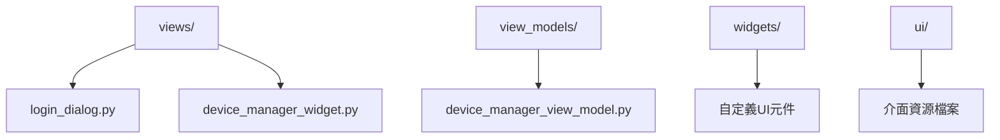
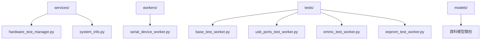
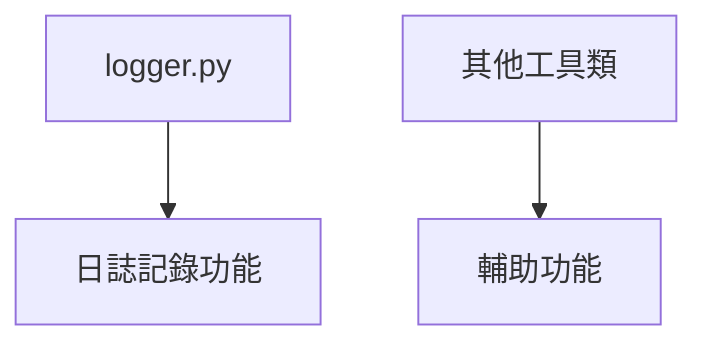
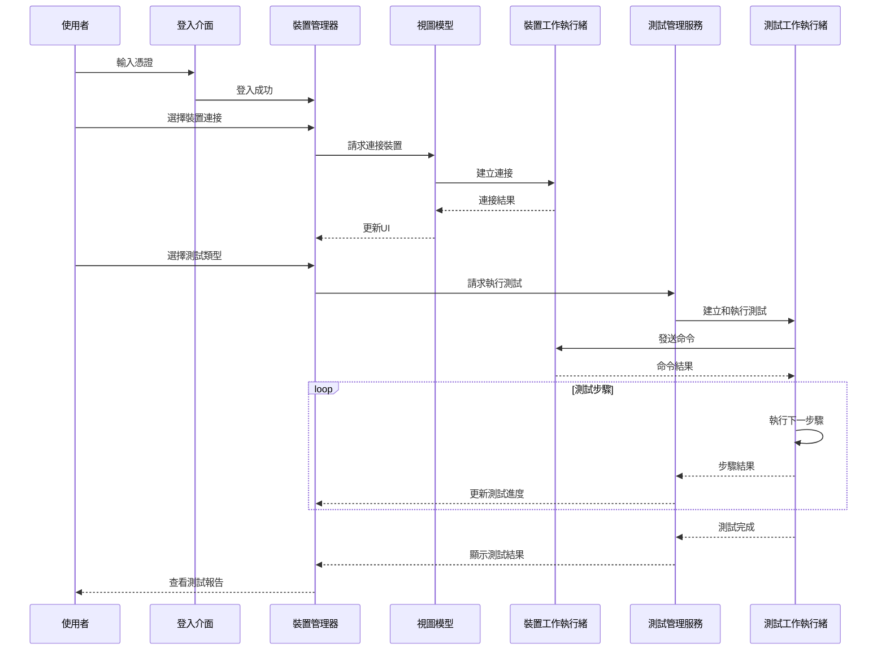
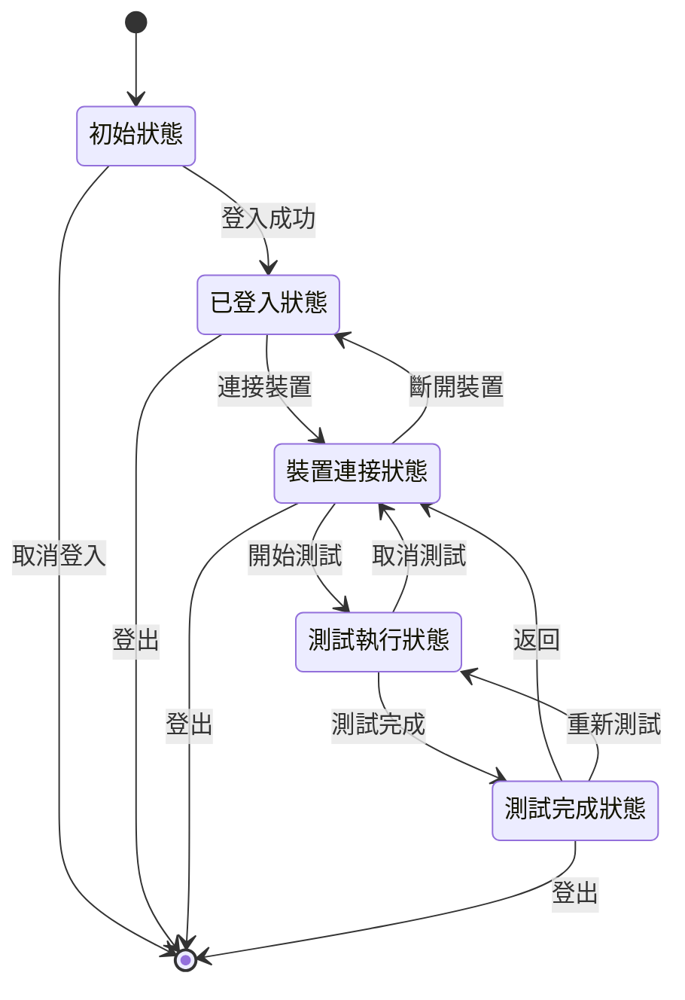
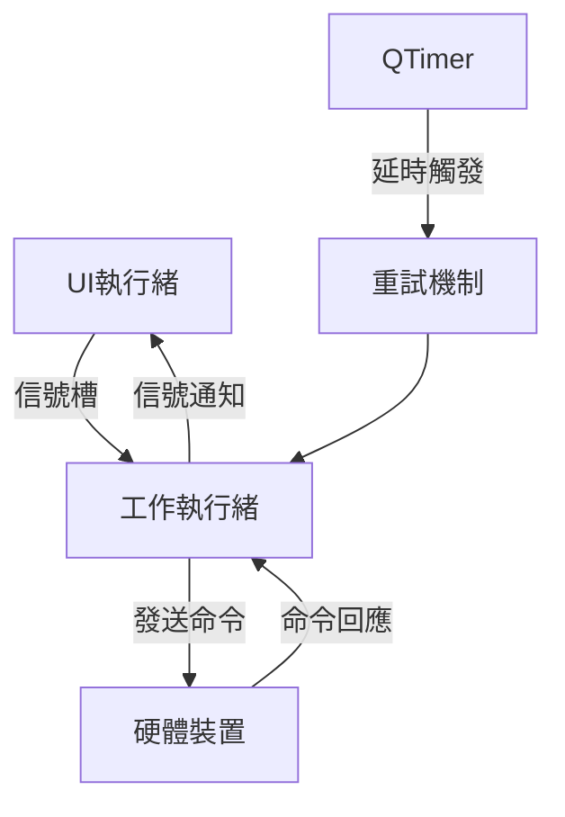
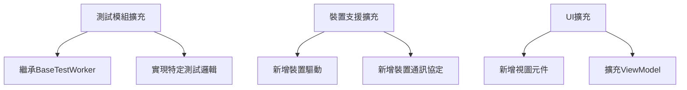
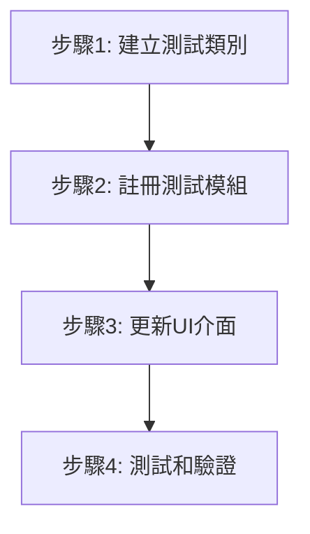

# Orion (VT Hydra) 開發文件

## 1. 系統概述

Orion（VT Hydra）是一個基於Python和PySide6（Qt）開發的硬體測試工具，用於管理和測試各種硬體裝置。系統主要透過串列通訊介面與硬體裝置進行互動，執行預定義的測試步驟，並提供使用者友善的圖形介面來展示測試結果。

系統的主要功能包含：
- 裝置連接和管理
- 硬體測試執行
- 測試資料收集與分析
- 多種硬體模組測試支援（USB連接埠、EMMC、EEPROM等）
- 可擴充的測試框架

## 2. 系統架構

Orion採用分層架構設計，遵循MVVM（Model-View-ViewModel）設計模式，清楚地分離了使用者介面、業務邏輯和資料模型，提高了程式碼的可維護性和可擴充性。

### 2.1 分層詳解

系統分為以下幾個主要層次：

1. **表現層（GUI）**：
   - 使用者介面元件，包含登入介面、裝置管理介面等
   - 基於PySide6實現，提供現代化的使用者體驗
   - 透過ViewModel與業務邏輯層互動

2. **業務邏輯層（Core）**：
   - 核心測試邏輯和測試步驟的定義與執行
   - 裝置管理和通訊服務
   - 測試工作執行緒和非同步操作處理

3. **資料層（Models）**：
   - 資料結構和模型定義
   - 狀態管理和資料儲存

4. **工具層（Util）**：
   - 日誌記錄
   - 通用功能和輔助工具

### 2.2 核心元件關係

核心元件之間的關係：

```mermaid
graph TD
    subgraph GUI
        A[DeviceManagerWidget]
        B[LoginDialog]
        C[其他UI元件]
        A --> B
        A --> C
    end
    
    subgraph ViewModel
        D[DeviceManagerViewModel]
    end
    
    subgraph Core
        E[HardwareTestManagerService]
        F[BaseTestWorker]
        G[SerialDeviceWorker]
        H[UsbPortsTestWorker]
        I[EmmcTestWorker]
        J[EepromTestWorker]
    end
    
    subgraph Util
        K[Logger]
    end
    
    A <--> D
    D <--> G
    D <--> E
    E --> F
    F <|-- H
    F <|-- I
    F <|-- J
    G <--> H
    G <--> I
    G <--> J
    K -.-> A
    K -.-> D
    K -.-> E
    K -.-> F
    K -.-> G
```

- **DeviceManagerWidget**：主要UI介面，負責使用者互動
  
- **DeviceManagerViewModel**：視圖模型，連接UI和業務邏輯
  
- **SerialDeviceWorker**：裝置通訊工作執行緒，負責與硬體裝置的串列通訊

- **HardwareTestManagerService**：測試管理服務，協調各種測試工作執行緒的執行

- **BaseTestWorker**：基礎測試工作執行緒，提供測試步驟定義和執行框架

- **各種具體測試工作執行緒**：如UsbPortsTestWorker、EmmcTestWorker等，實現具體測試邏輯

## 3. 核心模組說明

### 3.1 GUI 模組 (gui/)

GUI模組採用MVVM架構，包含以下子模組：



- **views/**: 包含各種視圖介面
  - `login_dialog.py`: 登入介面
  - `device_manager_widget.py`: 裝置管理主介面

- **view_models/**: 視圖模型，負責業務邏輯與UI的連接
  - `device_manager_view_model.py`: 裝置管理視圖模型，處理裝置連接和命令發送等操作

- **widgets/**: 可重複使用UI元件
  - 包含各種自定義控制項和UI元件

- **ui/**: 介面資源檔案
  - 包含UI設計檔案和資源

### 3.2 核心邏輯 (core/)

核心模組包含系統的主要業務邏輯：



- **services/**: 核心服務
  - `hardware_test_manager.py`: 硬體測試管理程式，協調測試執行
  - `system_info.py`: 系統資訊服務，收集和管理系統資訊

- **workers/**: 工作執行緒
  - `serial_device_worker.py`: 串列裝置工作執行緒，負責與裝置通訊

- **tests/**: 測試模組
  - `base_test_worker.py`: 基礎測試工作執行緒，提供測試框架
  - `usb_ports_test_worker.py`: USB連接埠測試
  - `emmc_test_worker.py`: EMMC測試
  - `eeprom_test_worker.py`: EEPROM測試

- **models/**: 資料模型
  - 定義各種資料結構和模型類別

### 3.3 公共元件 (util/)

工具模組提供全域可用的實用工具：



- `logger.py`: 日誌記錄器，提供統一的日誌記錄介面
- 其他通用功能和輔助工具

## 4. 執行流程

Orion系統的典型執行流程如下：



1. **系統啟動**：
   - 在`main.py`中建立PySide6應用程式實例
   - 設定應用程式樣式和圖示
   - 顯示登入介面

2. **使用者登入**：
   - 使用者在登入介面輸入憑證
   - 驗證成功後進入裝置管理介面

3. **裝置連接**：
   - 使用者在裝置管理介面選擇並連接裝置
   - `DeviceManagerViewModel`處理連接請求
   - `SerialDeviceWorker`執行實際的裝置連接操作

4. **測試執行**：
   - 使用者選擇要執行的測試類型
   - `HardwareTestManagerService`建立相應的測試工作執行緒
   - 測試工作執行緒執行預定義的測試步驟
   - 結果即時回饋到UI介面

5. **結果處理**：
   - 測試完成後，結果顯示在UI介面
   - 使用者可以查看詳細的測試報告
   - 可以選擇儲存或匯出測試結果

## 5. 系統狀態機

系統主要包含以下狀態：



1. **初始狀態**：系統啟動，等待登入

2. **已登入狀態**：使用者已登入，但尚未連接裝置

3. **裝置連接狀態**：
   - 已連接一個或多個裝置
   - 裝置資訊顯示在介面上
   - 可以執行測試操作

4. **測試執行狀態**：
   - 測試正在執行中
   - UI顯示測試進度和中間結果
   - 使用者可以取消測試

5. **測試完成狀態**：
   - 測試執行完畢
   - 顯示測試結果和詳細資訊
   - 可以返回到裝置連接狀態或執行其他測試

狀態轉換由使用者操作和系統事件觸發，例如登入成功、裝置連接/斷開、測試開始/完成等。

## 6. 非同步處理機制

Orion系統採用Qt的信號槽機制和工作執行緒來實現非同步處理：



1. **工作執行緒**：
   - `SerialDeviceWorker`：處理裝置通訊，避免阻塞UI
   - 各種`TestWorker`：執行測試步驟，非同步處理測試邏輯

2. **信號槽連接**：
   - 工作執行緒透過信號通知UI更新
   - 例如：`test_step_completed`、`test_completed`等信號

3. **非同步命令執行**：
   - 命令發送到裝置後不阻塞
   - 透過回呼函數或信號處理命令結果

4. **重試機制**：
   - 測試步驟執行失敗時自動重試
   - 使用QTimer實現延時重試
   - 重試次數和間隔可配置

## 7. 擴充性設計

系統設計具有高度的可擴充性：



1. **模組化架構**：
   - 核心元件透過介面互動，低耦合
   - 可以獨立擴充或替換各個模組

2. **測試框架**：
   - `BaseTestWorker`提供通用測試框架
   - 新的測試類型只需繼承並實現特定方法

3. **裝置支援**：
   - 設計支援多種裝置類型
   - 可以方便地新增裝置驅動程式

4. **介面擴充**：
   - 基於MVVM模式，UI和業務邏輯分離
   - 可以輕鬆新增介面元件和功能

## 8. 開發指南：建立新測試模組

要建立一個新的測試模組，請按照以下步驟操作：



1. **建立測試工作執行緒類別**：
   
   在`core/tests/`目錄下建立新的測試工作執行緒類別，繼承自`BaseTestWorker`：

   ```python
   from core.tests.base_test_worker import BaseTestWorker, TestStep

   class NewModuleTestWorker(BaseTestWorker):
       """新模組測試工作執行緒"""
       
       def prepare_test_steps(self):
           """準備測試步驟"""
           steps = []
           
           # 新增測試步驟
           steps.append(TestStep(
               command="test_command_1",
               expected_response="expected_result_1",
               description="第一個測試步驟",
               timeout=5,
               max_retries=2
           ))
           
           # 新增帶有自訂驗證函數的測試步驟
           steps.append(TestStep(
               command="test_command_2",
               validation_func=self._validate_step_2,
               description="第二個測試步驟",
               timeout=10
           ))
           
           return steps
           
       def _validate_step_2(self, response):
           """驗證第二個測試步驟的結果"""
           if "success" in response:
               return True, "測試通過"
           else:
               return False, f"測試失敗: {response}"
   ```

2. **在測試管理程式中註冊**：

   在`HardwareTestManagerService`類別的`_register_test_workers`方法中註冊新的測試工作執行緒：

   ```python
   def _register_test_workers(self):
       """註冊所有模組測試工作執行緒"""
       # 現有測試模組
       from core.tests.usb_ports_test_worker import UsbPortsTestWorker
       self._register_worker("usb_ports", UsbPortsTestWorker)
       
       # 新增新的測試模組
       from core.tests.new_module_test_worker import NewModuleTestWorker
       self._register_worker("new_module", NewModuleTestWorker)
   ```

3. **更新UI介面**：

   在裝置管理介面中新增測試模組的選項和介面元素。

4. **測試和驗證**：

   - 確保新模組按預期工作
   - 驗證測試步驟的執行和結果處理
   - 測試異常情況和邊界條件

透過遵循這些指南，你可以輕鬆地擴充Orion系統，新增測試功能，滿足更多的硬體測試需求。 