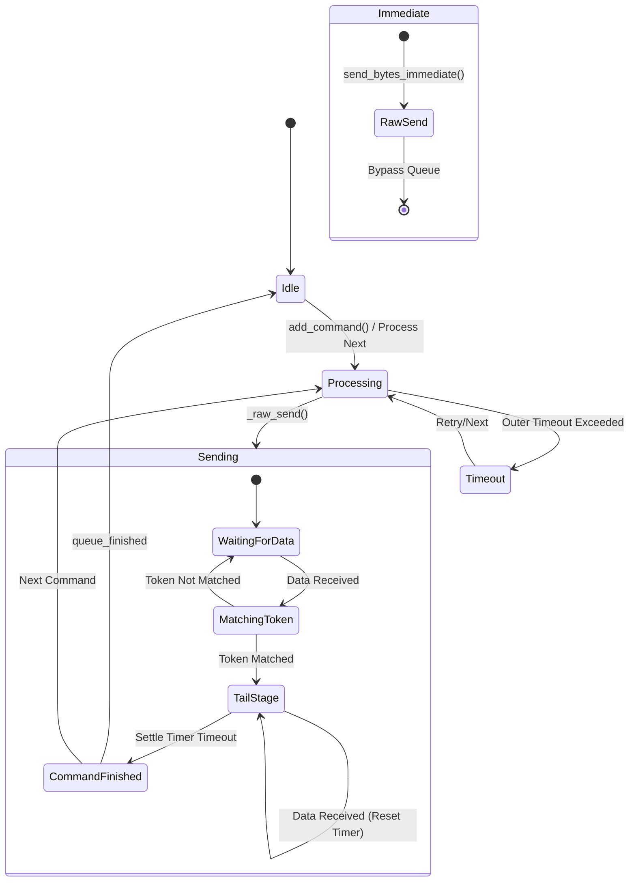
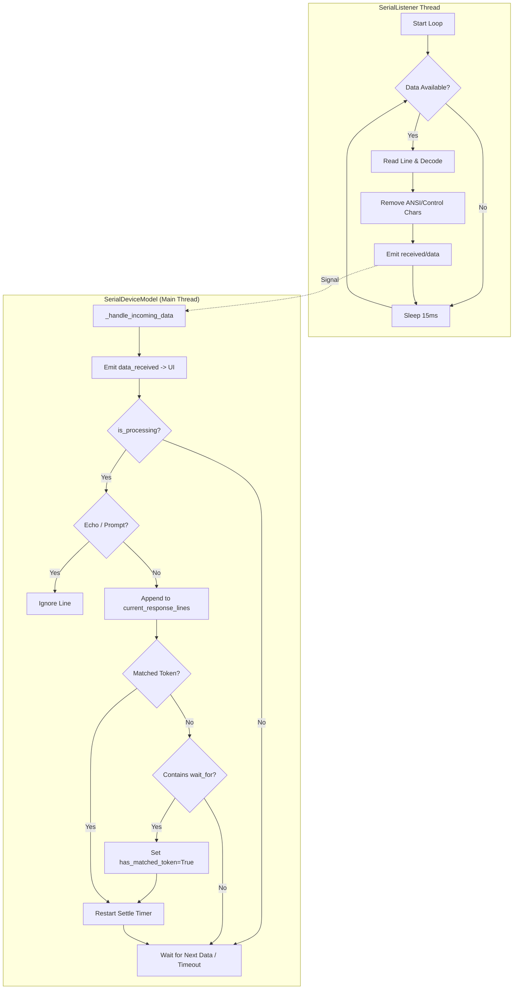
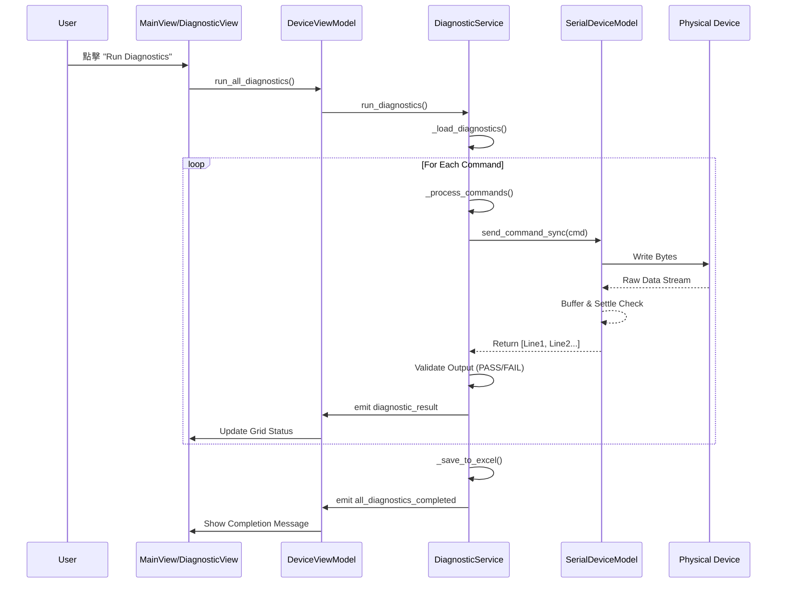

# Orion Project Development Document

## 1. 架構總覽 (High-Level Architecture)

Orion 專案採用標準的 **MVVM (Model-View-ViewModel)** 架構設計，以確保業務邏輯與使用者介面的分離，提升程式碼的可維護性與可測試性。

*   **Model (模型層)**:
    *   負責底層資料處理與邏輯運算。
    *   核心為 `SerialDeviceModel`，負責序列埠 (Serial Port) 通訊的底層實作，包含指令隊列管理、資料緩衝、逾時控制與回應解析。
    *   擁有獨立的執行緒 (`SerialListener`) 負責持續監聽序列埠資料。

*   **ViewModel (視圖模型層)**:
    *   作為 Model 與 View 之間的橋樑。
    *   `DeviceViewModel` 是主要的 ViewModel，負責協調各個服務模組 (Services) 與 Model 的互動。
    *   處理 UI 邏輯轉換，例如將 Model 的連線狀態轉換為 UI 的按鈕啟用/停用狀態。
    *   透過 Signal/Slot 機制與 View 進行非同步溝通。

*   **View (視圖層)**:
    *   基於 **PySide6 (Qt for Python)** 構建的使用者介面。
    *   包含 `MainView` 以及各功能子視圖 (`DiagnosticView`, `BatteryMonitorView`, `ControlPanelView` 等)。
    *   只負責顯示資料與捕捉使用者操作，不包含複雜的業務邏輯。

*   **Services (服務層)**:
    *   為了避免 ViewModel 過於龐大，將具體的功能邏輯拆分至 Service 中。
    *   包含 `DiagnosticService` (診斷), `BatteryMonitorService` (電池監控), `PlatformDetectionService` (平台偵測) 等。

## 2. 技術選型 (Technology Stack)

*   **程式語言**: Python 3.x
*   **GUI 框架**: PySide6 (Qt for Python 6.8.2.1)
*   **序列埠通訊**: pyserial 3.5
*   **資料處理與匯出**: openpyxl (Excel 報表生成)
*   **並發處理**: PySide6.QtCore (QThread, QTimer, QEventLoop)
*   **打包工具**: PyInstaller
*   **其他依賴**: numpy, matplotlib, pillow (影像處理/數據分析支援)

## 3. 核心模組設計 (Key Component Design)

### 3.1 SerialDeviceModel (序列裝置模型)
*   **職責**: 封裝所有 Serial Port 操作。
*   **關鍵機制**:
    *   **Command Queue (指令隊列)**: 使用 `deque` 實作 FIFO 隊列，確保指令依序執行，避免多執行緒衝突。
    *   **Smart Settle (智慧穩定機制)**: 在接收資料時，透過 `settle_timer` 判斷輸出是否結束 (Tail Stage)。當偵測到特定結束字元 (如 `#`) 且資料流靜止一段時間後，才視為指令完成。
    *   **Timeout Handling**: 具備 Outer Timeout (整體執行逾時) 與 Inner Settle Timeout (輸出穩定逾時) 雙重保護。
    *   **Sync/Async Metrics**: 同時支援同步 (`send_command_sync`) 與非同步 (`send_command_queued`) 呼叫方式。

### 3.2 DiagnosticService (診斷服務)
*   **職責**: 執行自動化硬體診斷流程。
*   **設計**:
    *   **Command Loader**: 動態從 JSON 設定檔載入各平台的測試指令。
    *   **Validator**: 內建 `DiagnosticValidator` 類別，支援 Regex 驗證、數值範圍檢查、關鍵字匹配等多種驗證策略。
    *   **Manual Check**: 支援暫停執行，跳出對話框要求使用者進行人工檢查 (如 LED 燈號確認)，待確認後恢復自動流程。
    *   **Excel Reporting**: 測試結束後自動生成詳細的 Excel 測試報告。

### 3.3 BatteryMonitorService (電池監控服務)
*   **職責**: 週期性監控電池狀態 (電壓, 電流, 容量, 溫度)。
*   **設計**:
    *   **Polling Loop**: 使用 `QTimer` 定期觸發查詢指令。
    *   **Data Parsing**: 針對不同暫存器回傳的 Hex String 進行解析 (Signed/Unsigned 轉換)。
    *   **Persistence**: 即時將數據寫入 Excel，防止程式崩潰導致長時間監控數據遺失。

### 3.4 StabilityTestWorker (穩定性測試 Worker)
*   **職責**: 獨立執行緒執行長時間的穩定性測試 (如 Ping Test)，避免阻塞 UI 主執行緒。
*   **設計**:
    *   **QThread Inheritance**: 繼承自 `QThread`，將測試邏輯與信號發射 (`result`, `ping_started`) 封裝於單一類別。
    *   **Network Isolation**: 測試執行前自動隔離非測試網路介面 (如測 WiFi 時中斷 Ethernet)，測試後自動恢復，確保測試路徑正確。
    *   **Interruption**: 支援即時中斷 (透過 `SerialDeviceModel` 的 `send_bytes_immediate` 發送 Ctrl+C)。

### 3.5 NetworkService (網路服務)
*   **職責**: 管理 WiFi 與 Ethernet 連線狀態。
*   **設計**:
    *   **nmcli Wrapper**: 封裝 `nmcli` 指令，提供 Scan, Connect, Disconnect, Status Check 等功能。
    *   **Isolation Support**: 提供 `disconnect_network` 與 `connect_device` 方法，支援測試時的網路隔離與恢復。

## 4. 工作流程 (High-Level Workflows)

### 4.1 自動診斷流程 (Diagnostic Workflow)
1.  **初始化**: `MainView` 呼叫 `DeviceViewModel.run_all_diagnostics()`。
2.  **載入設定**: `DiagnosticService` 根據當前偵測到的 `Platform Name` 載入對應的 JSON 指令集。
3.  **環境檢查**: 執行 Precondition Setup (如尋找 USB 路徑, 讀取 EEPROM 初始值)。
4.  **指令執行**: 依序從 Queue 取出測試項目。
    *   若是自動指令: 發送至 SerialModel 等待回應。
    *   若是人工檢查: 暫停 Queue，發送 `manual_check_requested` 信號通知 UI 彈出對話框。
5.  **結果驗證**: 收到的回應傳入 `DiagnosticValidator` 進行判斷 (PASS/FAIL)。
6.  **報告生成**: 所有項目執行完畢，匯總結果並儲存為 `.xlsx` 檔案。

### 4.2 電池監控流程 (Battery Monitor Workflow)
1.  **啟動**: 使用者點擊 "Start Monitor"。
2.  **查詢**: `BatteryMonitorService` 觸發 `get_all_battery_info`。
3.  **採集**: 依序發送 I2C 讀取指令 (Voltage, Current, SoC 等)。
4.  **解析**: 將 Hex 字串轉換為人類可讀數值。
5.  **記錄**: Append 一行數據至 Excel Log。
6.  **排程**: 計算耗時，動態調整下一次 `QTimer` 的觸發時間，確保採樣間隔穩定。

### 4.3 穩定性測試流程 (Stability Test Workflow)
1.  **啟動**: `StabilityTestView` 實例化 `StabilityTestWorker` 並執行 `.start()`。
2.  **網路準備**:
    *   若為 WiFi 測試: 連接指定的 SSID，並**斷開 eth0**。
    *   若為 Ethernet 測試: **斷開 WiFi 介面**。
3.  **執行測試**: 發送 `ping` 指令 (同步等待結果，但位於 Worker 線程不卡 UI)。
4.  **即時中斷**: 若使用者點擊 Stop，UI 透過 `DeviceViewModel` 呼叫 `send_bytes_immediate(b'\x03')` 發送 Ctrl+C 中斷測試。
5.  **清理與恢復**: 測試結束 (無論成功失敗)，Worker 在 `finally` 區塊呼叫 `NetworkService.connect_device("eth0")` 恢復網路環境。

## 5. 狀態機 (State Machine)

`SerialDeviceModel` 內部維護了一個隱式的狀態機來處理複雜的序列埠串流資料：

### 5.1 Command State Diagram

### 5.2 SerialListener Interaction Flowchart

以下流程圖說明了 `SerialListener` (獨立執行緒) 如何持續接收資料，並透過 Signal/Slot 機制與 `SerialDeviceModel` (主執行緒) 互動以判斷指令完成狀態：

### 狀態說明:
*   **Idle**: 空閒狀態，等待新指令。
*   **Processing**: 從 Queue 取出指令，準備執行。
*   **Sending**: 將指令 Bytes 寫入 Serial Port。
*   **MatchingToken**: 持續比對接收到的資料流是否包含結束 Token (如 Prompt `#`).
*   **TailStage**: 已匹配到 Token，進入觀察期 (Settle Time)，確保後續沒有殘餘輸出了 (避免斷字)。
*   **CommandFinished**: 判定指令完全結束，收集 Buffer 回傳。

## 6. 時序圖 (Sequence Diagram)

以下展示「執行單一診斷指令」的時序互動：

